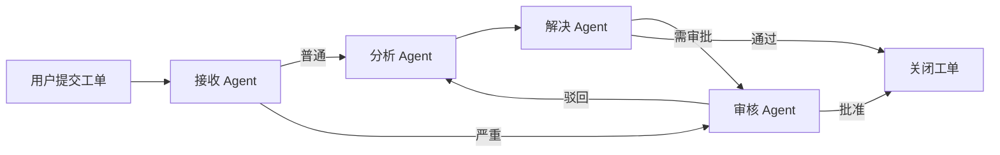

# 第 22 章 · 实战二：多代理工单处理系统

> 本章目标：
> - 掌握 LangGraph `StateGraph` 多 Agent 协作编排模式
> - 学会用条件边按工单类型路由到不同处理 Agent
> - 实现严重工单的人工审批（Human-in-the-loop）
> - 接入 Celery Worker 实现异步任务队列
> - 构建完整的工单全生命周期处理系统

本章是「实战二」：我们在实战一（RAG 知识库 Agent）的基础上，构建一个**多 Agent 协作的工单处理系统**。系统将涵盖工单从创建、分类、分析、解决到审核的全流程，并支持异步消息队列和人机协作。

本系统包含四个 Agent：
- **接收 Agent**：负责工单分类和优先级评估
- **分析 Agent**：分析工单根因并制定解决方案
- **解决 Agent**：执行实际修复操作
- **审核 Agent**：审核修复结果并决定最终状态

## 22.1 系统架构与 Agent 角色定义

### 22.1.1 整体架构



### 22.1.2 定义 Shared State

工单处理系统需要一个统一的状态结构来传递信息。我们使用 `TypedDict` 定义状态：

```python
# ticket_agent.py
from typing import TypedDict, Annotated, Literal
import operator
from langgraph.graph import StateGraph, START, END

# 工单类型枚举
class TicketPriority(Literal["low", "medium", "high", "critical"]):
    pass

# 工单状态枚举
class TicketStatus(Literal["new", "analyzed", "in_progress", "review", "resolved", "rejected", "closed"]):
    pass

class TicketState(TypedDict):
    # 使用 operator.add 进行消息列表合并
    messages: Annotated[list, operator.add]
    # 工单基本信息
    ticket_id: str
    title: str
    description: str
    # 分类结果
    category: str
    priority: TicketPriority
    # 处理流程
    analysis: str
    solution: str
    status: TicketStatus
    # 审批标记
    needs_review: bool
    approved: bool | None
    # 审计日志
    audit_log: list[str]
```

> 💡 状态设计要点：
> - `messages` 字段使用 `operator.add` 实现消息累积
> - `needs_review` 和 `approved` 支持中断恢复模式

### 22.1.3 定义四个 Agent 函数

```python
# ticket_agent.py (续)

def receive_agent(state: TicketState) -> dict:
    """接收 Agent：分类工单并评估优先级"""
    messages = state["messages"]
    last_message = messages[-1]["content"] if messages else ""
    
    # 模拟 LLM 分类逻辑
    if "严重" in last_message or "紧急" in last_message or "崩溃" in last_message:
        priority = "critical"
        category = "system_failure"
    elif "数据" in last_message or "丢失" in last_message:
        priority = "high"
        category = "data_issue"
    elif "功能" in last_message or "无法" in last_message:
        priority = "medium"
        category = "feature_bug"
    else:
        priority = "low"
        category = "general"
    
    audit_entry = f"[接收] 工单#{state['ticket_id']} 分类为 {category}，优先级 {priority}"
    return {
        "category": category,
        "priority": priority,
        "status": "analyzed",
        "audit_log": [audit_entry]
    }


def analyze_agent(state: TicketState) -> dict:
    """分析 Agent：分析根因并制定解决方案"""
    analysis = f"针对 {state['category']} 类工单，根因分析：需要进一步诊断。"
    if state["priority"] == "critical":
        analysis += " 建议立即启动应急预案。"
    
    audit_entry = f"[分析] 工单#{state['ticket_id']} 完成根因分析"
    return {
        "analysis": analysis,
        "solution": f"采用标准 {state['category']} 处理流程",
        "audit_log": [audit_entry]
    }


def resolve_agent(state: TicketState) -> dict:
    """解决 Agent：执行修复操作"""
    needs_review = state["priority"] in ("high", "critical")
    
    audit_entry = f"[解决] 工单#{state['ticket_id']} 修复完成，{'需审核' if needs_review else '自动通过'}"
    return {
        "status": "review" if needs_review else "closed",
        "needs_review": needs_review,
        "audit_log": [audit_entry]
    }


def review_agent(state: TicketState) -> dict:
    """审核 Agent：人工审核修复结果"""
    # 在真实场景中，这里会暂停等待人工审批
    # 演示中自动审批
    if state.get("approved"):
        status = "closed" if state["approved"] else "rejected"
        audit_entry = f"[审核] 工单#{state['ticket_id']} 被{'批准' if state['approved'] else '驳回'}"
        return {"status": status, "audit_log": [audit_entry]}
    else:
        # 需要人工介入时返回 interrupt
        return {
            "status": "review",
            "audit_log": [f"[审核] 工单#{state['ticket_id']} 等待人工审批"]
        }
```

## 22.2 构建 LangGraph 工作流

### 22.2.1 定义节点和边

```python
# ticket_agent.py (续)

# 构建图
workflow = StateGraph(TicketState)

# 添加节点
workflow.add_node("receive", receive_agent)
workflow.add_node("analyze", analyze_agent)
workflow.add_node("resolve", resolve_agent)
workflow.add_node("review", review_agent)

# 添加起始边
workflow.add_edge(START, "receive")

# 条件边：根据优先级路由
def route_by_priority(state: TicketState) -> str:
    """根据优先级决定下一步"""
    if state["priority"] in ("high", "critical"):
        return "review"  # 严重工单直接进入审核
    return "analyze"

workflow.add_conditional_edges(
    "receive",
    route_by_priority,
    {
        "analyze": "analyze",
        "review": "review"
    }
)

# 分析后的边
workflow.add_edge("analyze", "resolve")

# 解决后的条件路由
def route_after_resolve(state: TicketState) -> str:
    if state["needs_review"]:
        return "review"
    return END  # 直接关闭

workflow.add_conditional_edges(
    "resolve",
    route_after_resolve,
    {
        "review": "review",
        "__end__": END
    }
)

# 审核后的决策
def route_after_review(state: TicketState) -> str:
    if state.get("approved"):
        return END
    return "analyze"  # 驳回后重新分析

workflow.add_conditional_edges(
    "review",
    route_after_review,
    {
        "analyze": "analyze",
        "__end__": END
    }
)

# 编译图
app = workflow.compile()
```

### 22.2.2 运行工单处理流程

```python
# ticket_agent.py (续)

def process_ticket(ticket_id: str, description: str) -> dict:
    """处理单个工单"""
    initial_state = {
        "messages": [{"role": "user", "content": description}],
        "ticket_id": ticket_id,
        "title": f"工单 {ticket_id}",
        "description": description,
        "category": "",
        "priority": "low",
        "analysis": "",
        "solution": "",
        "status": "new",
        "needs_review": False,
        "approved": None,
        "audit_log": []
    }
    
    result = app.invoke(initial_state)
    return result


# 测试运行
if __name__ == "__main__":
    # 普通工单
    print("=== 处理普通工单 ===")
    result = process_ticket("T001", "界面按钮点击无响应")
    print(f"状态: {result['status']}")
    print(f"审计日志: {result['audit_log']}")
    
    # 严重工单
    print("\n=== 处理严重工单 ===")
    result = process_ticket("T002", "系统崩溃，数据丢失严重")
    print(f"状态: {result['status']}")
    print(f"审计日志: {result['audit_log']}")
```

## 22.3 实现 Human-in-the-loop 审批

### 22.3.1 使用 interrupt() 暂停执行

```python
# ticket_agent.py (续)
from langgraph.types import interrupt

def review_agent_with_approval(state: TicketState) -> dict:
    """审核 Agent：带人工审批的版本"""
    audit_entry = f"[审核] 工单#{state['ticket_id']} 等待人工审批"
    
    # 中断执行，等待人工决策
    approval = interrupt({
        "ticket_id": state["ticket_id"],
        "message": f"工单 {state['ticket_id']} 需要人工审核，请决定是否批准",
        "context": {
            "priority": state["priority"],
            "category": state["category"],
            "analysis": state["analysis"]
        }
    })
    
    approved = approval.get("approved", False)
    status = "closed" if approved else "rejected"
    audit_entry = f"[审核] 工单#{state['ticket_id']} 被{'批准' if approved else '驳回'}"
    
    return {
        "status": status,
        "approved": approved,
        "audit_log": [audit_entry]
    }
```

### 22.3.2 续跑中断后的工单

```python
# ticket_agent.py (续)

def resume_ticket(thread_id: str, approval_result: dict) -> dict:
    """续跑中断后的工单"""
    # 获取检查点
    checkpointer = app.checkpointer
    config = {"configurable": {"thread_id": thread_id}}
    
    # 续跑时传入人工审批结果
    result = app.invoke(approval_result, config)
    return result


def run_with_checkpointer():
    """演示带检查点的完整流程"""
    from langgraph.checkpoint.memory import MemorySaver
    
    # 创建带检查点的图
    app_with_checkpoint = workflow.compile(checkpointer=MemorySaver())
    
    config = {"configurable": {"thread_id": "ticket-T002"}}
    
    # 初始运行（会在 review 节点中断）
    initial_input = {
        "messages": [{"role": "user", "content": "系统崩溃，数据丢失严重"}],
        "ticket_id": "T002",
        "title": "工单 T002",
        "description": "系统崩溃，数据丢失严重",
        "category": "",
        "priority": "low",
        "analysis": "",
        "solution": "",
        "status": "new",
        "needs_review": False,
        "approved": None,
        "audit_log": []
    }
    
    print("=== 提交严重工单（将中断等待审批）===")
    try:
        result = app_with_checkpoint.invoke(initial_input, config)
    except Exception as e:
        print(f"预期中的中断: {e}")
    
    # 人工审批
    print("\n=== 人工审批中 ===")
    approval = {
        "ticket_id": "T002",
        "approved": True,
        "notes": "批准，已验证数据恢复"
    }
    
    # 续跑
    print("\n=== 续跑工单 ===")
    result = app_with_checkpoint.invoke(approval, config)
    print(f"最终状态: {result['status']}")
    print(f"审计日志: {result['audit_log']}")
```

## 22.4 接入 Celery 异步任务队列

### 22.4.1 Celery Worker 配置

```python
# worker.py
from celery import Celery
import json
from ticket_agent import process_ticket

# Celery 配置
celery_app = Celery(
    "ticket_worker",
    broker="redis://localhost:6379/0",
    backend="redis://localhost:6379/1"
)

@celery_app.task(bind=True, max_retries=3)
def process_ticket_async(self, ticket_data: dict):
    """异步处理工单"""
    try:
        ticket_id = ticket_data.get("ticket_id")
        description = ticket_data.get("description")
        
        print(f"[Worker] 开始处理工单 {ticket_id}")
        result = process_ticket(ticket_id, description)
        
        print(f"[Worker] 工单 {ticket_id} 处理完成: {result['status']}")
        return {
            "ticket_id": ticket_id,
            "status": result["status"],
            "audit_log": result["audit_log"]
        }
    except Exception as exc:
        # 自动重试
        print(f"[Worker] 工单处理失败，将在 60 秒后重试: {exc}")
        raise self.retry(exc=exc, countdown=60)


@celery_app.task
def bulk_process_tickets(ticket_list: list[dict]):
    """批量处理工单"""
    results = []
    for ticket_data in ticket_list:
        result = process_ticket_async.apply_async(
            args=[ticket_data],
            task_id=f"ticket_{ticket_data['ticket_id']}"
        )
        results.append({
            "ticket_id": ticket_data["ticket_id"],
            "async_id": result.id
        })
    return results
```

### 22.4.2 FastAPI 接口

```python
# server.py
from fastapi import FastAPI, BackgroundTasks
from pydantic import BaseModel
from worker import process_ticket_async, bulk_process_tickets
import uuid

app = FastAPI(title="Agent 工单处理系统")

class TicketRequest(BaseModel):
    description: str
    title: str = ""

class TicketResponse(BaseModel):
    ticket_id: str
    status: str
    message: str

@app.post("/tickets", response_model=TicketResponse)
async def create_ticket(request: TicketRequest, background_tasks: BackgroundTasks):
    """创建并提交工单（异步处理）"""
    ticket_id = f"T{uuid.uuid4().hex[:6].upper()}"
    
    # 提交到 Celery 队列
    task = process_ticket_async.delay({
        "ticket_id": ticket_id,
        "description": request.description,
        "title": request.title or f"工单 {ticket_id}"
    })
    
    return TicketResponse(
        ticket_id=ticket_id,
        status="queued",
        message=f"工单已提交，异步处理中 (task_id: {task.id})"
    )

@app.get("/tickets/{ticket_id}")
async def get_ticket_status(ticket_id: str):
    """查询工单处理状态"""
    from worker import celery_app
    task = celery_app.AsyncResult(ticket_id)
    
    return {
        "ticket_id": ticket_id,
        "status": task.status,
        "result": task.result if task.ready() else None
    }

@app.post("/tickets/bulk")
async def create_bulk_tickets(tickets: list[TicketRequest]):
    """批量创建工单"""
    results = bulk_process_tickets.delay([
        {
            "ticket_id": f"T{uuid.uuid4().hex[:6].upper()}",
            "description": t.description,
            "title": t.title or f"工单 {uuid.uuid4().hex[:6]}"
        }
        for t in tickets
    ])
    return {"message": f"已提交 {len(tickets)} 个工单", "async_id": results.id}
```

### 22.4.3 启动服务

```bash
# 启动 Redis
docker run -d -p 6379:6379 redis:7

# 启动 Celery Worker
celery -A worker.celery_app worker --loglevel=info

# 启动 FastAPI 服务
uvicorn server:app --reload --port 8000
```

## 22.5 完整系统集成

### 22.5.1 主程序入口

```python
# main.py
"""
多代理工单处理系统 - 主入口
集成 LangGraph + Celery + FastAPI
"""
import asyncio
from datetime import datetime
from ticket_agent import process_ticket, workflow
from worker import celery_app

def demo_workflow():
    """演示完整工作流"""
    print("=" * 50)
    print("多代理工单处理系统演示")
    print("=" * 50)
    
    # 测试用例
    test_cases = [
        ("T001", "界面按钮点击无响应", "low"),
        ("T002", "数据库连接超时，服务降级", "high"),
        ("T003", "系统崩溃，用户数据丢失", "critical"),
    ]
    
    for ticket_id, description, expected_priority in test_cases:
        print(f"\n--- 处理工单 {ticket_id} ---")
        result = process_ticket(ticket_id, description)
        print(f"  最终状态: {result['status']}")
        print(f"  优先级: {result['priority']}")
        print(f"  处理日志:")
        for entry in result['audit_log']:
            print(f"    {entry}")
    
    print("\n" + "=" * 50)
    print("演示完成")

if __name__ == "__main__":
    demo_workflow()
```

### 22.5.2 项目结构

```
ticket-system/
├── ticket_agent.py      # LangGraph 工作流定义
├── worker.py            # Celery 异步任务
├── server.py            # FastAPI 接口
├── main.py              # 主程序入口
├── requirements.txt
└── README.md
```

## 本章小结

本章构建了一个完整的多代理工单处理系统，涵盖了：

1. **StateGraph 多节点编排**：四个 Agent 各司其职，形成完整处理链
2. **条件边路由**：根据优先级和状态动态路由到不同节点
3. **Human-in-the-loop**：使用 `interrupt()` 实现人工审批节点
4. **检查点与续跑**：支持中断后的状态恢复和人工决策续跑
5. **Celery 异步队列**：实现工单异步处理和批量处理

### 关键知识点

| 概念 | 用途 | 代码位置 |
|---|---|---|
| `StateGraph` | 定义状态驱动的有向图 | `ticket_agent.py` |
| `add_conditional_edges` | 根据状态动态选择下一步 | `route_by_priority` 等 |
| `interrupt()` | 暂停执行等待外部输入 | `review_agent_with_approval` |
| `MemorySaver` | 检查点持久化 | 演示代码 |
| `@celery_app.task` | 异步任务装饰器 | `worker.py` |

## 🛠️ 动手实践

1. **扩展工单类型**：添加更多分类规则（如安全漏洞、性能问题），并设计对应的处理流程
2. **实现持久化存储**：将工单数据存入 SQLite 或 PostgreSQL，实现跨重启的状态恢复
3. **添加消息推送**：集成 WebSocket 或邮件服务，在工单状态变更时通知相关人员

<Quiz :items="quiz" />

<script setup>
const quiz = [
  {
    question: "在 LangGraph 中，如何定义状态图？",
    options: [
      "使用 @workflow decorator",
      "使用 StateGraph 类",
      "使用 GraphBuilder 函数",
      "使用 FlowDiagram 类"
    ],
    answer: 1,
    explanation: "LangGraph 使用 StateGraph 类来定义状态驱动的有向图，通过 add_node 和 add_edge 方法构建图结构。"
  },
  {
    question: "以下哪个方法用于实现 Human-in-the-loop？",
    options: [
      "workflow.interrupt()",
      "interrupt()",
      "workflow.pause()",
      "state.hold()"
    ],
    answer: 1,
    explanation: "langgraph.types 模块提供的 interrupt() 函数用于在节点执行时暂停，等待外部输入后恢复执行。"
  },
  {
    question: "Celery Worker 处理工单失败时，默认行为是什么？",
    options: [
      "立即终止进程",
      "无限重试",
      "最多重试 3 次后标记失败",
      "跳过该工单继续处理下一个"
    ],
    answer: 2,
    explanation: "示例中使用了 max_retries=3 参数，配合 retry() 方法实现自动重试，超过上限后标记失败。"
  },
  {
    question: "条件边 route_by_priority 返回的值会用作什么？",
    options: [
      "工单优先级编号",
      "下一个节点的名称",
      "审批意见",
      "审计日志内容"
    ],
    answer: 1,
    explanation: "add_conditional_edges 的 edge_fn 返回值对应条件边映射中的 key，用于选择下一个要执行的节点。"
  }
]
</script>
