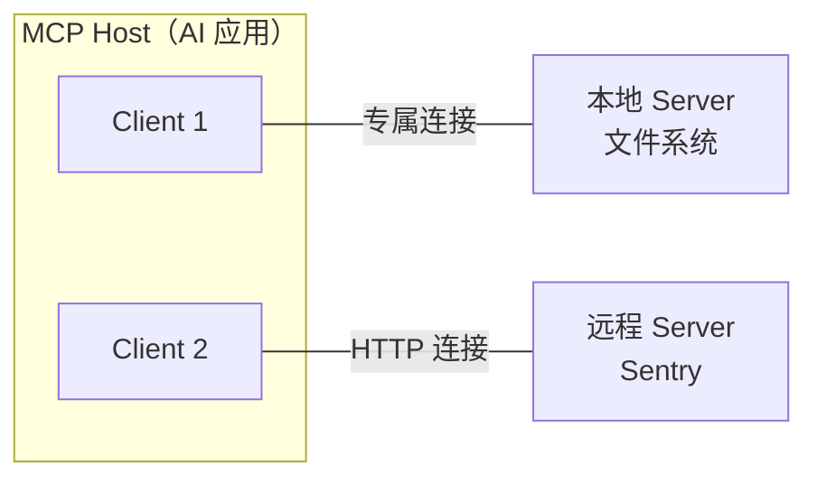

# 第 16 章 · MCP 概述与架构

> 本章目标：理解 MCP（Model Context Protocol）要解决的集成爆炸问题，掌握 Host/Client/Server 三层架构的职责划分，并能说清它与 function calling、传统插件体系的本质区别。

## 10.1 集成爆炸问题

在 MCP 出现之前，把 LLM 应用接入外部数据源和工具是典型的 M×N 问题：M 个 AI 应用（Claude Desktop、IDE 插件、自研 Agent……）各自要对接 N 个数据源（GitHub、Slack、Postgres、文件系统……），最坏情况要写 M×N 套定制集成。每个应用都要重复实现认证、发现、调用、错误处理——而且彼此不兼容。

MCP（Model Context Protocol）是 Anthropic 于 2024 年 11 月开源的**开放标准**，目标是把这个公式变成 **M+N**：

- 数据源方实现一次 MCP Server，就能被所有支持 MCP 的应用使用；
- AI 应用实现一次 MCP Client，就能接入整个 Server 生态。

这与 USB-C 的标准化逻辑相同：设备与外设不再一一配对，而是共同遵守一个接口规范。

## 10.2 MCP 是什么、不是什么

根据官方架构文档，理解 MCP 要抓住三条边界：

1. **它是一个协议规范 + 配套 SDK 与工具链**：包含规范文本、多语言 SDK（Python/TypeScript/Java/Kotlin/C# 等）、调试工具 MCP Inspector、以及官方参考 Server 实现；
2. **底层用 JSON-RPC 2.0 编码消息**：客户端与服务端互相发请求、响应与通知；
3. **它只管上下文交换的协议，不规定 AI 应用如何使用 LLM 或如何管理这些上下文**——模型编排逻辑完全留给应用层。

::: tip 一个常见误解
MCP 不是"另一个 function calling"。Function calling 是模型厂商 API 层面的能力；MCP 是应用与外部工具/数据源之间的**标准连接协议**。两者是互补关系，第 11 章会展开。
:::

## 10.3 三层参与者：Host / Client / Server

MCP 采用客户端-服务端架构，三个角色职责分明：

| 角色 | 职责 | 典型例子 |
|---|---|---|
| **Host（宿主）** | 协调管理一个或多个 Client 的 AI 应用 | Claude Desktop、Claude Code、VS Code |
| **Client（客户端）** | 维护与某个 Server 的连接、为 Host 获取上下文 | VS Code 运行时里实例化的连接对象 |
| **Server（服务器）** | 通过协议向 Client 提供上下文与能力 | 文件系统 Server、Sentry Server |

关键细节：**每个 Server 对应一个专属 Client**。以官方文档的例子来说——VS Code 作为 Host 连接 Sentry MCP Server 时会实例化一个 Client；再连接本地文件系统 Server 时又实例化另一个 Client。

连接拓扑还有一条经验规律：

```text
本地 Server（stdio 传输）：通常只服务单个 Client
远程 Server（Streamable HTTP 传输）：通常同时服务多个 Client
```

在 Host 中声明这些连接的典型配置（以 Claude Desktop 为例）：

```json
{
  "mcpServers": {
    "filesystem": {
      "command": "npx",
      "args": ["-y", "@modelcontextprotocol/server-filesystem", "/Users/me/docs"]
    },
    "sentry": {
      "url": "https://mcp.sentry.dev/mcp"
    }
  }
}
```

每个条目都会让 Host 实例化一个独立的 Client——本地 Server 用 command 启动子进程（stdio），远程 Server 用 url 直连（Streamable HTTP）。



## 10.4 分层视角：数据层与传输层

官方架构把协议拆成两层来看：

**数据层**定义客户端与服务端之间的消息 schema 与语义：

- 基于 JSON-RPC 2.0：请求（request）、响应（response）、通知（notification）三种消息；
- MCP 是**无状态协议**：每个请求都在 `_meta` 字段里携带协议版本与能力声明，服务端可以独立处理每个请求；
- 服务端通过强制的 `server/discover` 请求对外宣告自己支持的版本与能力，客户端可缓存发现结果。

一次典型的发现交互长这样：

```json
// 客户端在任何业务请求前先发发现请求
{
  "jsonrpc": "2.0",
  "id": 1,
  "method": "server/discover",
  "params": {
    "_meta": {
      "io.modelcontextprotocol/protocolVersion": "2026-07-28",
      "io.modelcontextprotocol/clientInfo": { "name": "my-agent", "version": "1.0" }
    }
  }
}
```

服务端返回的结果通常可缓存，避免每个业务请求都重复发现流程。

**传输层**定义消息如何帧化与投递（第 12 章展开）：stdio 与 Streamable HTTP 两种标准绑定。协议语义在所有传输上保持一致——传输只是"绑定"，不改变消息含义。

这种分层让"写一个 MCP Server"这件事的复杂度大大降低：SDK 把两层都封装好了，开发者只需要声明自己的工具和数据。

## 10.5 与 Function Calling / 传统插件的对比

| 维度 | Function Calling | 传统插件体系 | MCP |
|---|---|---|---|
| 所在层级 | 模型 API 能力 | 各应用私有实现 | 应用与外部资源间的开放协议 |
| 标准化 | 各厂商格式不同（OpenAI/Anthropic 略有差异） | 无标准，每家一套 | 开放标准 + 多语言 SDK |
| 复用性 | 工具逻辑与应用耦合 | 插件不可跨应用移植 | 一次实现 Server，处处可用 |
| 发现机制 | 开发者手动传入工具列表 | 安装时静态注册 | 动态 `*/list` 发现 + 变更通知 |
| 双向能力 | 单向（应用调模型） | 视实现而定 | 客户端与服务端可互发请求 |

实际项目中的典型组合是：**应用通过 MCP Client 发现 Server 提供的工具 → 把工具描述转换成 function calling 的格式喂给模型 → 模型决定调用 → 应用经 MCP 执行并把结果回传给模型**。MCP 管"连接与发现"，function calling 管"模型决策"。

## 10.6 生态现状

围绕 MCP 已经形成完整生态：

- **官方参考实现**：modelcontextprotocol/servers 仓库提供文件系统、Git、Slack、Google Drive 等 Server 实现；
- **多语言 SDK**：Python（含 FastMCP 高层封装）、TypeScript、Java、Kotlin、C# 等，覆盖主流后端技术栈；
- **调试工具**：MCP Inspector 支持浏览器、CLI、TUI 三种形态测试 Server；
- **广泛采用**：Claude Desktop/Claude Code 原生支持，各大 IDE 与 Agent 框架相继接入，社区 Server 数量持续增长。

对开发者的意义：无论你用哪个模型厂商的 API，只要遵循 MCP，你的工具集成成果就是可迁移资产。

## 本章小结

- MCP 把 AI 应用与外部资源的 M×N 定制集成压缩为 M+N：数据源实现一次 Server，应用实现一次 Client；
- 它是基于 JSON-RPC 2.0 的开放标准，只管上下文交换协议，不管应用的模型编排逻辑；
- 三层参与者：Host 管理 AI 应用全局，Client 与 Server 一一对应维持连接，Server 提供能力；
- 协议分数据层（无状态、`_meta` 元数据、`server/discover` 发现）与传输层（stdio / Streamable HTTP）；
- MCP 与 function calling 互补：前者管连接发现，后者管模型决策，生产系统通常两者并用。

<Quiz :items="quiz" />

## 🛠️ 动手实践

1. 在纸上画出你所在团队的一个 AI 应用接入 3 个内部系统的架构图，分别标出 M×N 方案与 M+N 方案需要维护的集成数量。
2. 安装 MCP Inspector（`npx @modelcontextprotocol/inspector`），用它连接一个官方文件系统 Server，浏览其暴露的工具列表。
3. 阅读 modelcontextprotocol/servers 仓库中 filesystem Server 的源码目录结构，记录它的入口文件、工具定义方式与你预期的异同。

> 完成练习后，进入。


> 完成后进入[下一章：核心原语：Tools/Resources/Prompts](./ch17.md)。<script setup>
const quiz = [
  {
    question: 'MCP 把集成复杂度从 M×N 降低为 M+N，这里的 M 和 N 分别指什么？',
    options: [
      'M 个模型和 N 个提示词',
      'M 个 AI 应用（Host）和 N 个数据源/工具（Server 实现）',
      'M 台机器和 N 个网络端口',
      'M 个用户和 N 个会话'
    ],
    answer: 1,
    explain: '没有 MCP 时，M 个 AI 应用各自对接 N 个数据源最坏需要 M×N 套集成；有了标准协议，应用只需实现一次 Client、数据源只需实现一次 Server。'
  },
  {
    question: '关于 MCP Host、Client、Server 的关系，正确的是？',
    options: [
      '一个 Host 只能有一个 Client',
      'Client 与 Server 是一对多的，一个 Client 同时连多个 Server',
      'Host 内部为每个 Server 创建一个专属 Client 来维持对应连接',
      'Server 之间直接通信不需要经过 Client'
    ],
    answer: 2,
    explain: '官方架构明确：Host（如 VS Code）每建立一个 Server 连接就实例化一个专属 MCP Client，因此连接数与 Server 数量相等且彼此独立。'
  },
  {
    question: '下面哪件事属于 MCP 协议的职责范围？',
    options: [
      '决定模型收到上下文后如何推理',
      '规定 AI 应用的 UI 如何展示对话',
      '以 JSON-RPC 2.0 格式在 Client 与 Server 之间交换上下文消息',
      '训练模型学会调用新工具'
    ],
    answer: 2,
    explain: 'MCP 只负责上下文交换协议（基于 JSON-RPC 2.0）；如何使用 LLM、如何编排上下文、UI 如何呈现都属于应用层的事务，协议明确不管这些。'
  },
  {
    question: 'MCP 与 function calling 的关系是什么？',
    options: [
      'MCP 是 function calling 的替代品，用了 MCP 就不能再有函数调用',
      '两者互补：MCP 负责工具的标准化连接与发现，function calling 负责模型的调用决策',
      'function calling 是 MCP 规范的一部分',
      '两者互不相干，不能配合使用'
    ],
    answer: 1,
    explain: '生产中的典型模式是：应用通过 MCP 发现工具并转成 function calling 格式交给模型决策，再经 MCP 执行。一个管"连接"，一个管"决策"。'
  }
]
</script>
