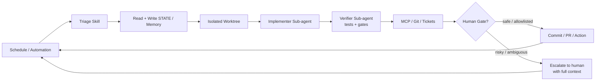

# 第 26 章 · Loop Engineering：从提示到循环

> 本章目标：理解"停止提示，设计循环"的核心理念，掌握五大积木 + Memory 架构，能用 Loop Ready Score 评估自己的循环是否生产就绪。

## 26.1 核心理念：从提示到循环

Peter Steinberger 说过一句被广泛引用的话：

> "You shouldn't be prompting coding agents anymore. You should be designing loops that prompt your agents."

Boris Cherny（Claude Code 负责人）也表达了类似观点：

> "I don't prompt Claude anymore. I have loops running that prompt Claude and figuring out what to do. My job is to write loops."

这句话点出了**杠杆点的转移**：从"craft 单个 prompt"到"design 控制循环"。

### 单次提示 vs 循环的差别

| 维度 | 单次提示 | 循环 |
|---|---|---|
| 你提供的 | "下一步做什么" | "最终状态长什么样" |
| agent 做的 | 执行一次 | 循环直到达成目标 |
| 谁判断完成 | 你 | 可验证的停止条件 |
| 你能走开吗 | 不能 | 输入 `/goal` 后即可离开 |

## 26.2 五大积木 + Memory

Loop Engineering 把所有循环拆解为五个基础积木，外加一个贯穿始终的 Memory 层：

| 积木 | 职责 | 典型实现 |
|---|---|---|
| **Automations / Scheduling** | 定时发现 + 分诊 | cron、GitHub Actions、`/loop` 命令 |
| **Worktrees** | 安全并行执行 | `git worktree add`、`loop-worktree` 工具 |
| **Skills** | 持久化项目知识 | SKILL.md、技能目录 |
| **Plugins & Connectors** | 连接真实工具 | MCP server、GitHub API、Slack bot |
| **Sub-agents** | maker/checker 分离 | 独立子代理执行 + 验证 |
| **+ Memory / State** | 跨会话持久化 | STATE.md、PROGRESS.md、git commits |

### 循环解剖图

## 26.3 四种循环类型

| 类型 | 触发方式 | 停止条件 | 典型场景 |
|---|---|---|---|
| **Turn-based** | 手动输入每条提示 | agent 认为完成 或 你打断 | 小任务、探索性工作 |
| **Goal-based** | 给定一个目标 | 独立评估器确认完成 或 达到上限 | `/goal` 复杂任务 |
| **Time-based** | 定时调度 | 手动停止 或 任务自然退出 | `/loop` 监控、周期性检查 |
| **Event-driven** | 外部事件（PR 打开、CI 失败） | 处理后退出 或 达到重试上限 | CI/CD 集成、响应式工作流 |

::: tip 区分 /goal 与 /loop
两者都带"loop"但解决不同问题：
- `/goal`：一个大任务，循环直到完成（马拉松）
- `/loop`：一个小动作，周期重复执行（闹钟）
:::

## 26.4 Loop Ready Score

官方 CLI 提供 `loop audit` 命令，扫描仓库并给出 **0–100 的 Loop Ready Score**，衡量循环是否具备生产就绪条件。审计维度包括：

| 维度 | 检查内容 |
|---|---|
| **Skills** | 是否存在格式紧凑的分诊技能；技能描述是否"无聊而具体" |
| **State** | 状态文件 schema 是否明确；每轮是否读旧写新 |
| **Maker/Checker 分离** | 实现者与验证者是否独立 |
| **Budget** | 是否有预算定义与超限动作 |
| **Constraints** | 路径黑名单、尝试次数上限等约束是否成文 |
| **Governance / Run log** | 是否有运行日志与 LOOP.md 自描述 |

## 本章小结

- Loop Engineering 的核心是"设计循环而不是写提示"；
- 五大积木（Automations/Worktrees/Skills/Plugins&Connectors/Sub-agents）+ Memory 构成完整架构；
- 四种循环类型对应不同触发与停止场景；
- Loop Ready Score 提供生产就绪的量化评估。

<Quiz :items="quiz" />

## 🛠️ 动手实践

1. 用 `npx @cobusgreyling/loop init . --pattern daily-triage --tool claude` 初始化一个 Daily Triage 循环，运行 `loop doctor` 查看健康状态。
2. 为一个简单任务设计一个 `/goal` 循环，明确目标、验证方法和停止条件。
3. 阅读 `loop-audit` 的输出，理解每个审计维度的含义，并针对最低分维度改进你的循环。

> 完成练习后，进入[下一章：七大生产循环模式](./ch27.md)。

