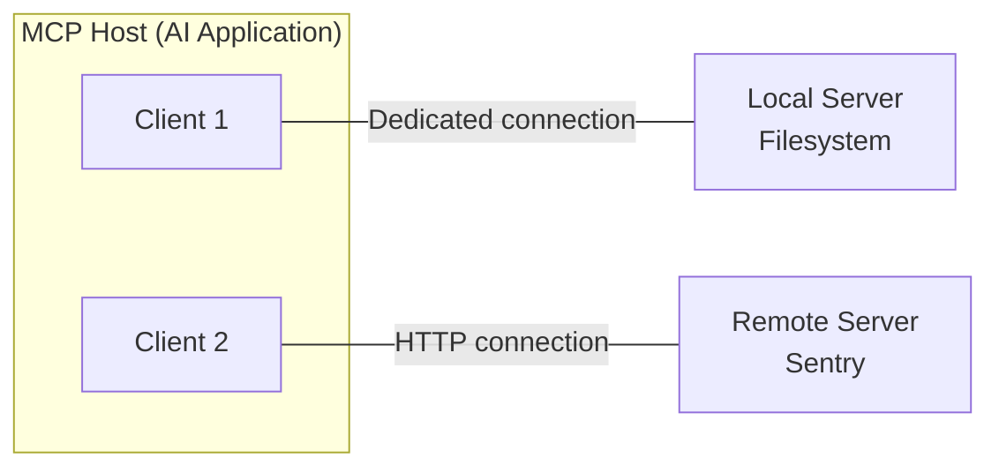

# Chapter 16 · MCP Overview and Architecture

> Chapter goals: Understand the integration explosion problem that MCP (Model Context Protocol) aims to solve, master the responsibility division of the Host/Client/Server three-layer architecture, and clarify its essential difference from function calling and traditional plugin systems.

## 16.1 The Integration Explosion Problem

Before MCP existed, connecting LLM applications to external data sources and tools was a typical M×N problem: M AI applications (Claude Desktop, IDE plugins, custom Agents…) each needed to对接 N data sources (GitHub, Slack, Postgres, filesystem…); worst case requires writing M×N sets of custom integrations. Each application had to repeatedly implement auth, discovery, invocation, error handling — and they were incompatible with each other.

MCP (Model Context Protocol) is an **open standard** open-sourced by Anthropic in November 2024, aiming to transform this formula into **M+N**:

- Data source providers implement an MCP Server once, and it can be used by所有 supporting MCP applications;
- AI applications implement an MCP Client once, and they can接入 the entire Server ecosystem.

This is the same standardization logic as USB-C: devices and peripherals no longer pair one-to-one; they共同遵守 a single interface specification.

## 16.2 What MCP Is and Isn't

According to the official architecture docs, understanding MCP requires grasping three boundaries:

1. **It is a protocol spec +配套 SDK and tooling**: includes spec text, multi-language SDKs (Python/TypeScript/Java/Kotlin/C#, etc.), debugging tool MCP Inspector, and official reference Server implementations;
2. **Underlying message encoding uses JSON-RPC 2.0**: clients and servers互相 send requests, responses, and notifications;
3. **It only governs the protocol for context exchange — it does not dictate how AI applications use LLMs or manage this context** — model orchestration logic is entirely left to the application layer.

::: tip A Common Misconception
MCP is not "another function calling." Function calling is a capability at the model vendor API level; MCP is a **standard connection protocol** between applications and external tools/data sources. The two are complementary — Chapter 17 elaborates.
:::

## 16.3 Three Participants: Host / Client / Server

MCP adopts a client-server architecture with three roles, each with clear responsibilities:

| Role | Responsibility | Typical Example |
|---|---|---|
| **Host** | Coordinates and manages one or more Clients | Claude Desktop, Claude Code, VS Code |
| **Client** | Maintains a connection to a Server; fetches context for the Host | Connection object instantiated in the VS Code runtime |
| **Server** | Provides context and capabilities to the Client via the protocol | Filesystem Server, Sentry Server |

Key detail: **each Server corresponds to a dedicated Client.** In the official文档 example — when VS Code as Host connects to the Sentry MCP Server, it instantiates one Client; when connecting to the local filesystem Server, it instantiates another.

There is also a rule of thumb for the connection topology:

```text
Local Server (stdio transport): typically serves a single Client only
Remote Server (Streamable HTTP transport): typically serves multiple Clients simultaneously
```

Typical configuration declaring these connections in a Host (using Claude Desktop as an example):

```json
{
  "mcpServers": {
    "filesystem": {
      "command": "npx",
      "args": ["-y", "@modelcontextprotocol/server-filesystem", "/Users/me/docs"]
    },
    "sentry": {
      "url": "https://mcp.sentry.dev/mcp"
    }
  }
}
```

Each entry causes the Host to instantiate an independent Client — local Servers use command to spawn a subprocess (stdio); remote Servers connect directly via url (Streamable HTTP).



## 16.4 Layered Perspective: Data Layer and Transport Layer

The official architecture拆 the protocol into two layers:

**The data layer** defines the message schema and semantics between client and server:

- Based on JSON-RPC 2.0: three message types — request, response, notification;
- MCP is a **stateless protocol**: each request carries protocol version and capability declarations in the `_meta` field; the server can process each request independently;
- The server externally declares supported versions and capabilities via a mandatory `server/discover` request; clients可 cache the discovery结果.

A typical discover interaction looks like this:

```json
// Client sends discover request before any business request
{
  "jsonrpc": "2.0",
  "id": 1,
  "method": "server/discover",
  "params": {
    "_meta": {
      "io.modelcontextprotocol/protocolVersion": "2026-07-28",
      "io.modelcontextprotocol/clientInfo": { "name": "my-agent", "version": "1.0" }
    }
  }
}
```

The server's response is typically cacheable, avoiding repeating the discovery流程 for every business request.

**The transport layer** defines how messages are framed and delivered (elaborated in Chapter 18): stdio and Streamable HTTP are the two standard bindings. Protocol semantics are consistent across all transports — transport is just a "binding"; it does not改变 message meaning.

This layering greatly reduces the complexity of "writing an MCP Server": the SDK封装s both layers, and developers only need to声明 their tools and data.

## 16.5 Comparison with Function Calling / Traditional Plugins

| Dimension | Function Calling | Traditional Plugin System | MCP |
|---|---|---|---|
| Layer | Model API capability | Each application's private implementation | Open protocol between applications and external resources |
| Standardization | Different formats per vendor (OpenAI/Anthropic略有差异) | No standard, each has its own | Open standard + multi-language SDK |
| Reusability | Tool logic coupled to application | Plugins不可 cross-application | Implement Server once, usable everywhere |
| Discovery mechanism | Developer manually passes tool list | Static registration at install time | Dynamic `*/list` discovery + change notifications |
| Bidirectional capability | Unidirectional (application calls model) | Depends on implementation | Client and server可互发 requests |

The typical combination in real projects is: **application discovers tools provided by the Server via MCP Client → converts tool descriptions to function calling format to feed the model → model decides to call → application执行 via MCP and回传 the result to the model**. MCP管 "connection and discovery"; function calling管 "model decision."

## 16.6 Ecosystem Status

A完整 ecosystem around MCP has already formed:

- **Official reference implementations**: modelcontextprotocol/servers repo provides Server implementations for filesystem, Git, Slack, Google Drive, etc.;
- **Multi-language SDKs**: Python (with FastMCP high-level wrapper), TypeScript, Java, Kotlin, C#, covering mainstream backend tech stacks;
- **Debugging tools**: MCP Inspector supports browser, CLI, and TUI three forms to test Servers;
- **Wide adoption**: native support in Claude Desktop/Claude Code, major IDEs and Agent frameworks相继接入, community Server count growing steadily.

What this means for developers: regardless of which model vendor's API you use, as long as you遵循 MCP, your tool integration成果 is a portable asset.

## Chapter Summary

- MCP compresses the M×N custom integration of AI applications and external resources into M+N: data sources implement one Server; applications implement one Client;
- It is an open standard based on JSON-RPC 2.0, governing only the context exchange protocol, not the application's model orchestration logic;
- Three participants: Host manages the AI application globally; Client and Server are one-to-one maintaining connections; Server provides capabilities;
- The protocol拆 into data layer (stateless, `_meta` metadata, `server/discover` discovery) and transport layer (stdio / Streamable HTTP);
- MCP complements function calling: the former管 connection and discovery; the latter管 model decision; production systems通常 use both.

<Quiz :items="quiz" />

## 🛠️ Hands-on Practice

1. Draw on paper the architecture of an AI application in your team connecting to 3 internal systems, labeling respectively the number of integrations required by the M×N方案 and the M+N方案.
2. Install MCP Inspector (`npx @modelcontextprotocol/inspector`) and use it to connect to an official filesystem Server; browse its exposed tool list.
3. Read the source code directory structure of the filesystem Server in the modelcontextprotocol/servers repo; record its entry file, tool definition approach, and how it compares with your expectations.

> After completing the exercises, proceed to [Next chapter: Core Primitives: Tools/Resources/Prompts](./ch17.md).

<script setup>
const quiz = [
  {
    question: 'In MCP reducing integration complexity from M×N to M+N, what do M and N分别指?',
    options: [
      'M models and N prompts',
      'M AI applications (Hosts) and N data sources/tools (Server implementations)',
      'M machines and N network ports',
      'M users and N sessions'
    ],
    answer: 1,
    explain: 'Without MCP, M AI applications各自对接 N data sources requires worst case M×N sets of integrations; with the standard protocol, applications only implement one Client and data sources only implement one Server.'
  },
  {
    question: 'Regarding the relationship between MCP Host, Client, and Server, which is correct?',
    options: [
      'A Host can only have one Client',
      'Client-to-Server is one-to-many; one Client同时 connects to multiple Servers',
      'The Host creates a dedicated Client for each Server to maintain its对应 connection',
      'Servers communicate directly without going through Clients'
    ],
    answer: 2,
    explain: 'The official architecture明确: the Host (e.g. VS Code) instantiates a dedicated MCP Client for each Server connection, so the number of connections equals the number of Servers and they are彼此独立.'
  },
  {
    question: 'Which of the following falls within MCP protocol\'s responsibility?',
    options: [
      'Deciding how the model reasons after receiving context',
      'Specifying how the AI application\'s UI displays conversations',
      'Exchanging context messages between Client and Server in JSON-RPC 2.0 format',
      'Training the model to learn to调用 new tools'
    ],
    answer: 2,
    explain: 'MCP only负责 the context exchange protocol (based on JSON-RPC 2.0); how to use the LLM, how to orchestrate context, how the UI is presented are all application-layer concerns that the protocol explicitly does not govern.'
  },
  {
    question: 'What is the relationship between MCP and function calling?',
    options: [
      'MCP is a replacement for function calling; using MCP means no more function calling',
      'They are complementary: MCP管 standardized connection and discovery; function calling管 model decision-making',
      'Function calling is part of the MCP spec',
      'They are unrelated and cannot be used together'
    ],
    answer: 1,
    explain: 'The typical production模式 is: the application discovers tools via MCP and converts them to function calling format for the model to decide, then执行 via MCP. One管 "connection"; the other管 "decision."'
  }
]
</script>
