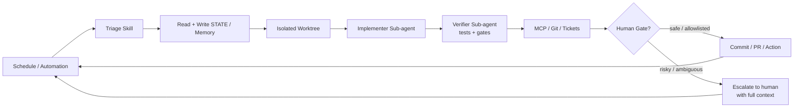

# Chapter 26 · Loop Engineering: From Prompts to Loops

> Chapter goals: Understand the core philosophy of "stop prompting, design loops," master the five-building-blocks + Memory architecture, and评估 your own loops for production-readiness using Loop Ready Score.

## 26.1 Core Philosophy: From Prompts to Loops

Peter Steinberger once said a widelyquoted line:

> "You shouldn't be prompting coding agents anymore. You should be designing loops that prompt your agents."

Boris Cherny (head of Claude Code) expressed a similar view:

> "I don't prompt Claude anymore. I have loops running that prompt Claude and figuring out what to do. My job is to write loops."

This points to the **shift in leverage point**: from "crafting a single prompt" to "designing the control loop."

### Single Prompt vs. Loop

| Dimension | Single Prompt | Loop |
|---|---|---|
| What you提供 | "What to do next" | "What the final state should look like" |
| What the agent does | Execute once | Loop until the goal is达成 |
| Whojudges completion | You | Verifiable stop条件 |
| Can you walk away? | No | Yes — input `/goal` and leave |

## 26.2 Five Building Blocks + Memory

Loop Engineering拆解 all loops into five basic blocks, plus a Memory layer贯穿始终:

| Block | Responsibility | Typical Implementation |
|---|---|---|
| **Automations / Scheduling** |定时 discovery + triage | cron, GitHub Actions, `/loop` command |
| **Worktrees** | Safe parallel execution | `git worktree add`, `loop-worktree` tool |
| **Skills** | Persistent project knowledge | SKILL.md, skills directory |
| **Plugins & Connectors** | Connect to real tools | MCP server, GitHub API, Slack bot |
| **Sub-agents** | maker/checker separation | Independent sub-agent execution + verification |
| **+ Memory / State** | Cross-session persistence | STATE.md, PROGRESS.md, git commits |

### Loop Anatomy Diagram

## 26.3 Four Loop Types

| Type | Trigger | Stop Condition | Typical Scenario |
|---|---|---|---|
| **Turn-based** | Manually input each prompt | Agent认为完成 or you打断 | Small tasks, exploratory work |
| **Goal-based** | Given a goal | Independent evaluator confirms完成 or reaches上限 | `/goal` complex tasks |
| **Time-based** | Scheduled timing | Manually stop or the task自然 exits | `/loop` monitoring, periodic checks |
| **Event-driven** | External events (PR opened, CI failed) | Exit after处理 or reach retry上限 | CI/CD integration, responsive workflows |

::: tip Distinguish /goal vs. /loop
Both带 "loop" but solve不同 problems:
- `/goal`: one大 task; loops until完成 (a marathon)
- `/loop`: one小动作;周期 repeated execution (an alarm clock)
:::

## 26.4 Loop Ready Score

The official CLI provides a `loop audit` command that scans the repo and gives a **0–100 Loop Ready Score**, measuring whether the loop具备 production-readiness. Audit dimensions include:

| Dimension | Check Content |
|---|---|
| **Skills** | Whether a compact-format triage skill exists; whether the skill description is "boring but specific" |
| **State** | Whether the state file schema is明确; whether each round读旧写新 |
| **Maker/Checker Separation** | Whether the implementer and verifier are独立 |
| **Budget** | Whether there is a budget定义 and over-limit actions |
| **Constraints** | Whether path denylists, attempt上限, and other constraints are成文 |
| **Governance / Run log** | Whether there is a run log and LOOP.md self-description |

## Chapter Summary

- The core of Loop Engineering is "design loops, not写 prompts";
- Five blocks (Automations/Worktrees/Skills/Plugins&Connectors/Sub-agents) + Memory form the完整架构;
- Four loop types correspond to different trigger and stop scenarios;
- Loop Ready Score provides a quantitative评估 of production-readiness.

<Quiz :items="quiz" />

## 🛠️ Hands-on Practice

1. Use `npx @cobusgreyling/loop init . --pattern daily-triage --tool claude` to initialize a Daily Triage loop; run `loop doctor` to查看 the health status.
2. Design a `/goal` loop for a simple task;明确 the goal, verification method, and stop condition.
3. Read the output of `loop-audit`;理解 each audit dimension; and改进 your loop针对 the lowest-scoring dimension.

> After completing the exercises, proceed to [Next chapter: Seven Production Loop Patterns](./ch27.md).

