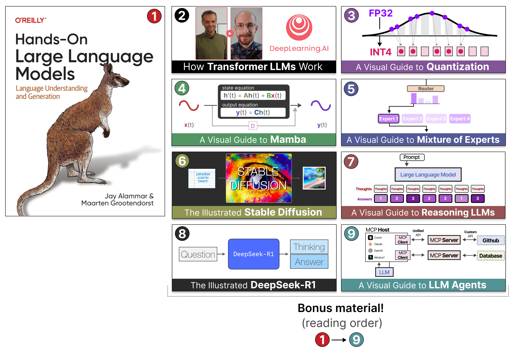
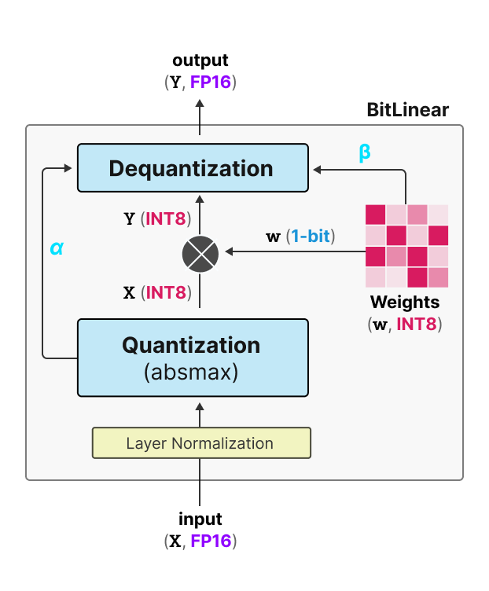
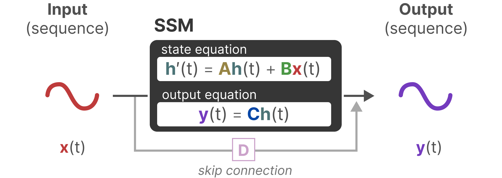
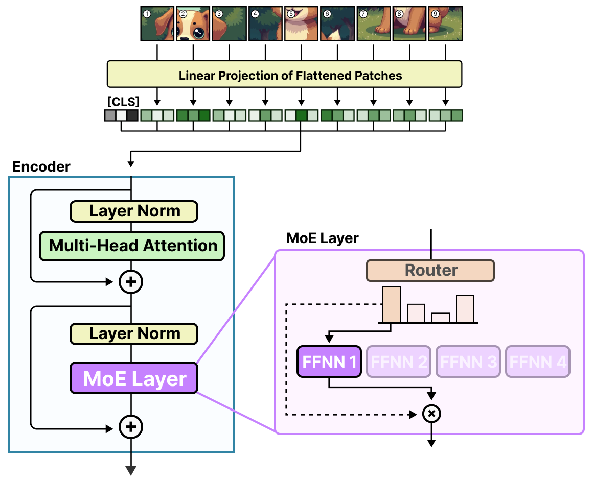
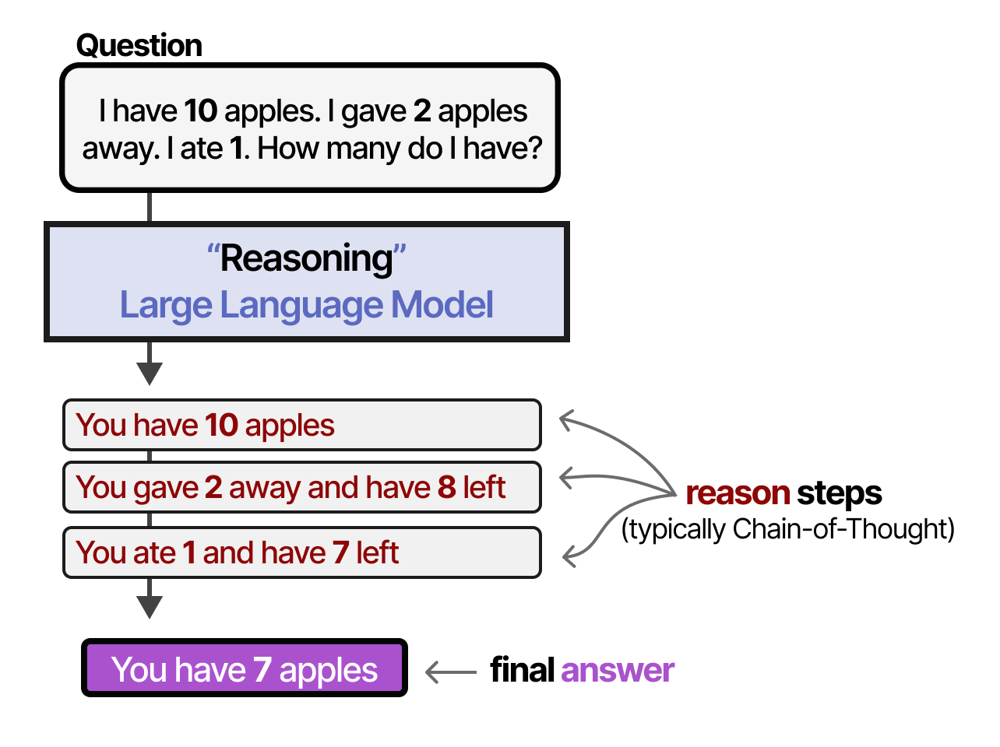
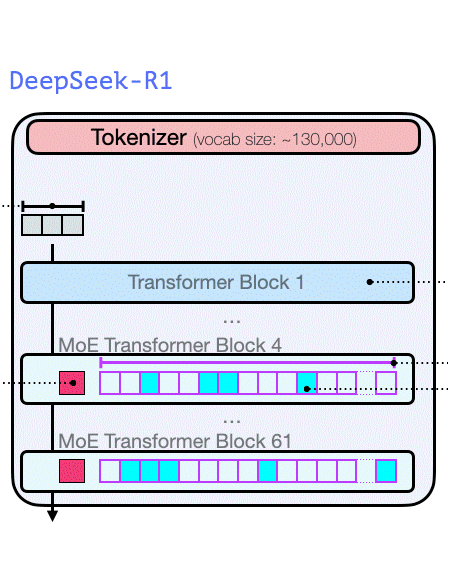
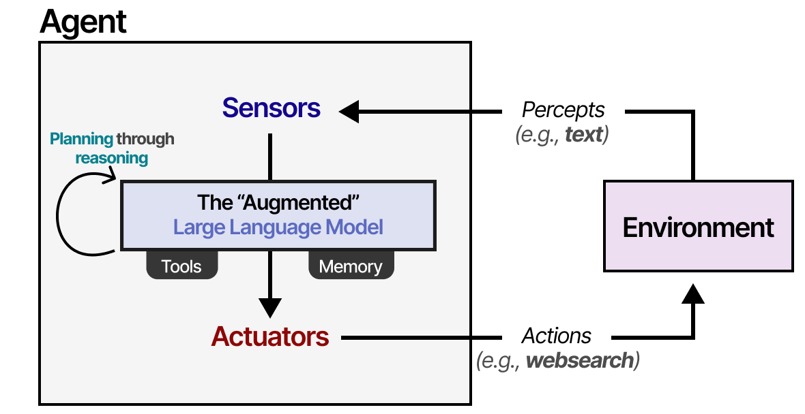
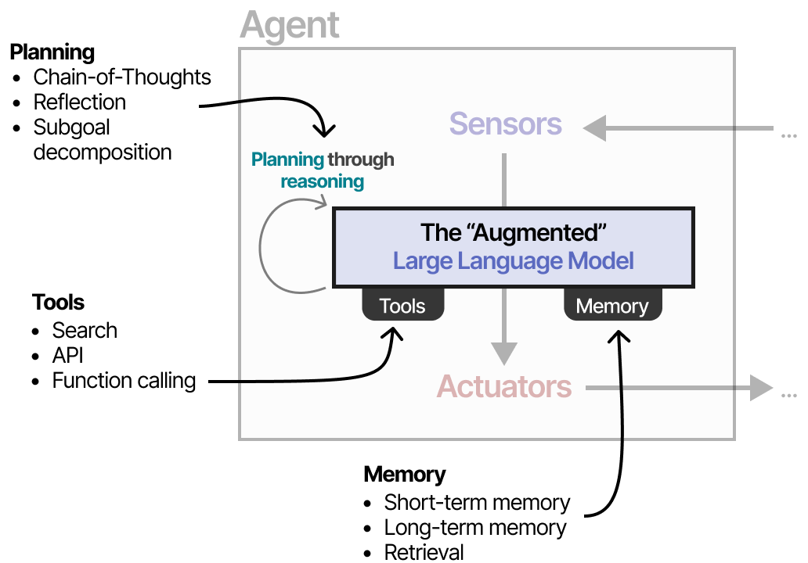
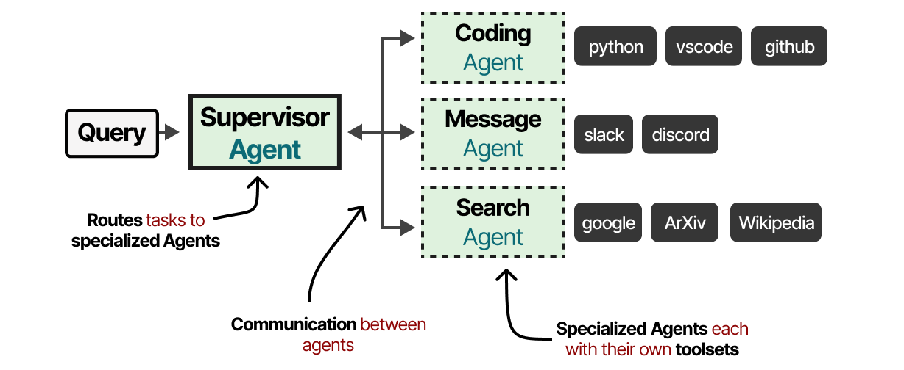

# Bonus Material

> This chapter corresponds to the `bonus/` directory in the repository. The book is limited in篇幅 (~400 pages), and the author continues to produce in-depth guides outside the book in the same **visual, illustrated style**. The following 8 articles are all included with illustrations; click the title to jump to the original.

## 1. How Transformer LLMs Work (DeepLearning.AI Course)

*Deepen the content of the entire book*

The author collaborated with DeepLearning.AI to transform the core content of the book into a short course, covering the主要 components of Transformer LLMs. This **highly animated** course can further strengthen your intuition for the book's content.

You will learn: key components such as tokenization, embeddings, self-attention, and transformer blocks; recent improvements to attention mechanisms such as KV cache, multi-query attention, grouped-query attention, and sparse attention; a comparison of tokenization strategies across modern LLMs; and an exploration of Transformers in the Hugging Face Transformers library.

## 2. A Visual Guide to Quantization

*Extends Chapters 7 and 12*

The book introduces the concept of quantization and how it reduces computational demands for training and fine-tuning. [A Visual Guide to Quantization](https://newsletter.maartengrootendorst.com/p/a-visual-guide-to-quantization) dives deeper into the technical details on top of the book:

The guide explores multiple quantization methods — post-training quantization and quantization-aware training — and even showcases BitNet: a method that yields three-value parameters (only 3 possible values!).

## 3. A Visual Guide to Mamba and State Space Models

*An "alternative" to Chapter 3*

Not an extension but a "replacement" for Chapter 3! [This guide](https://newsletter.maartengrootendorst.com/p/a-visual-guide-to-mamba-and-state) provides a序列 modeling approach fundamentally different from the decoder-only Transformer in Chapter 3 — State Space Models:

This领域 is not limited to Transformers; exciting hybrid architectures are even beginning to [combine Transformer blocks with Mamba blocks](https://www.ai21.com/blog/announcing-jamba).

## 4. A Visual Guide to Mixture of Experts (MoE)

*Extends Chapter 3*

Chapter 3 lays the foundation for the traditional Transformer decoder and also covers advances in efficient attention and positional embeddings. One technique that is not detailed but is increasingly important is **Mixture of Experts** — enhancing the Transformer decoder by introducing multiple specialized sub-networks ("experts"):

The [MoE visual guide](https://newsletter.maartengrootendorst.com/p/a-visual-guide-to-mixture-of-experts) explains how MoE models dynamically route different inputs to the most suitable expert, thereby processing diverse language tasks more efficiently; it then extends into the vision-language领域:

## 5. The Illustrated Stable Diffusion

*Extends Chapter 9*

Chapter 9 introduces Vision Transformer (ViT) and demonstrates how CLIP enables joint modeling of text and images — bringing images into text models so they can "reason" about images. And CLIP can also be used in reverse: bring text into visual models to guide image generation with words.

[The Illustrated Stable Diffusion](https://jalammar.github.io/illustrated-stable-diffusion/) explores CLIP's role in Stable Diffusion in the一贯 highly visual style:

It further dissects the internal working principles of Stable Diffusion — how it combines CLIP's capabilities with advanced diffusion models to生成 high-quality images from text prompts:

## 6. A Visual Guide to Reasoning LLMs

*Extends Chapters 6 and 12*

The book discusses how chain-of-thought improves output quality by extending reasoning. [A Visual Guide to Reasoning LLMs](https://newsletter.maartengrootendorst.com/p/a-visual-guide-to-reasoning-llms) goes a step further: describing the paradigm shift from **train-time compute** (more data, longer training, larger models) to **test-time compute** (extending inference through "reasoning"):

The guide explores multiple reasoning distillation techniques across training and inference phases, and specifically introduces the highly influential 2024 model DeepSeek-R1:

## 7. The Illustrated DeepSeek-R1

*Extends Chapter 12*

Chapter 12 covers common techniques for creating and fine-tuning models — language modeling, supervised fine-tuning, and preference tuning — focusing on non-reasoning models. DeepSeek-R1 is an unexpectedly released reasoning LLM, an open-weight model that competes with OpenAI o1.

[The Illustrated DeepSeek-R1](https://newsletter.languagemodels.co/p/the-illustrated-deepseek-r1/) dissects the model and its training process. Interestingly, it uses a rule-based validator to ensure the reasoning process adheres to specific standards, such as confirming that code can actually compile:

Its architecture is [Mixture-of-Experts](#4-a-visual-guide-to-mixture-of-experts-moe), with 256 experts (8 activated at a time) — quite massive:

## 8. A Visual Guide to LLM Agents

*Extends Chapters 7 and 8*

Chapters 7 and 8 show how to extend LLM capabilities by providing tools, memory, and other mechanisms, and briefly introduce methodologies for实现 autonomous behavior (such as Reason and Act, ReAct). [A Visual Guide to LLM Agents](https://newsletter.maartengrootendorst.com/p/a-visual-guide-to-llm-agents) dives deep into how to让 LLM act autonomously (i.e. as an Agent):

First an overview of the main components of an Agent…

…then a detailed explanation of the three core components: **tools**, **memory**, and **planning**:

The tools section深入 explores the **Model Context Protocol** (MCP) — showcasing this increasingly popular Agent tool-use standard:

**Planning** is the core of this guide; it is the主要 component that gives LLM Agents autonomous behavior:

Implementing autonomous behavior is only the first step; the guide最后 describes multi-Agent collaboration — multiple Agents共同完成 predefined goals:

