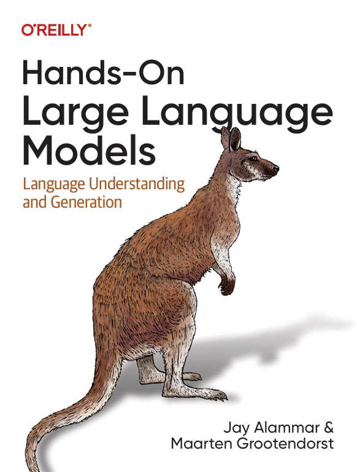

# Chapter 1 · Introduction to Language Models

> Chapter goals: Explore the exciting field of Language AI, load and run your first language model Phi-3, and complete a text generation task.

## 1.1 About This Chapter and This Book

This chapter is the companion notebook for Chapter 1 of *Hands-On Large Language Models* by Jay Alammar and Maarten Grootendorst (O'Reilly). The book explains LLM internals and practice through extensive visual illustrations:



*Above: The book cover.*

The book contains 12 chapters in total, starting from Tokens and embeddings, progressively covering classification, clustering, prompt engineering, semantic search, multimodal models, and fine-tuning:


*Above: An overview of all 12 chapters.*

You can also open the original notebook for this chapter in Google Colab: [Open In Colab](https://colab.research.google.com/github/HandsOnLLM/Hands-On-Large-Language-Models/blob/main/chapter01/Chapter%201%20-%20Introduction%20to%20Language%20Models.ipynb).

## 1.2 [Optional] Installing Dependencies in Colab

If you are viewing this notebook on Google Colab (or any other cloud provider), you need to **uncomment and run** the following code block to install the chapter dependencies:

```python
# %%capture
# !pip install transformers==4.41.2 accelerate==0.31.0
```

💡 **Note**: We need a GPU to run the examples in this notebook. In Google Colab, go to
**Runtime > Change runtime type > Hardware accelerator > GPU > GPU type > T4**.

## 1.3 Phi-3: Loading the Model and Tokenizer

The first step is to load the model onto the GPU for faster inference. Note that we load the model and tokenizer separately (although this is not always necessary).

```python
from transformers import AutoModelForCausalLM, AutoTokenizer

# Load model and tokenizer
model = AutoModelForCausalLM.from_pretrained(
    "microsoft/Phi-3-mini-4k-instruct",
    device_map="cuda",
    torch_dtype="auto",
    trust_remote_code=False,
)
tokenizer = AutoTokenizer.from_pretrained("microsoft/Phi-3-mini-4k-instruct")
```

## 1.4 Wrapping the Generator with a Pipeline

Although we can use the model and tokenizer directly, wrapping them in a `pipeline` object is much more convenient:

```python
from transformers import pipeline

# Create a pipeline
generator = pipeline(
    "text-generation",
    model=model,
    tokenizer=tokenizer,
    return_full_text=False,
    max_new_tokens=500,
    do_sample=False
)
```

## 1.5 First Conversation: Asking the Model to Tell a Joke

Finally, we create a prompt as the user and send it to the model:

```python
# The prompt (user input / query)
messages = [
    {"role": "user", "content": "Create a funny joke about chickens."}
]

# Generate output
output = generator(messages)
print(output[0]["generated_text"])
```

The model will return a text joke about chickens. The `messages` uses a conversational role format (`role` + `content`), and `return_full_text=False` means only the newly generated portion is returned without including the input prompt.

## 1.6 Chapter Summary

- *Hands-On Large Language Models* contains 12 chapters in total, progressing layer by layer from Token embeddings to fine-tuning generative models;
- Use `AutoModelForCausalLM` and `AutoTokenizer` to load the model and tokenizer separately (example: `microsoft/Phi-3-mini-4k-instruct`), and place them on the GPU via `device_map="cuda"`;
- `pipeline("text-generation", ...)` is the most convenient inference wrapper, `max_new_tokens=500` controls generation length, and `do_sample=False` indicates greedy decoding;
- Conversational input uses a `messages` list, where each message contains `role` and `content` fields;
- Running the examples requires a GPU (e.g., T4 on Colab).

<Quiz :items="quiz" />

## 🛠️ Hands-on Practice

1. After installing dependencies as described in Section 1.2, run the code from Sections 1.3–1.5 completely in a GPU environment (local or Colab T4), replace the prompt in `messages` with an English question, and observe the model output.
2. Set `do_sample=True` in the `pipeline` and add the `temperature=0.7` parameter to regenerate the joke. Compare the differences between greedy decoding (`do_sample=False`) and sampled decoding outputs.
3. Change `max_new_tokens` to 50 and 500 respectively, run each once, record the changes in generation length, and explain the difference in output when `return_full_text=False` versus `True`.

<script setup>
const quiz = [
  {
    question: 'Which core class is used in this chapter to load a pre-trained language model?',
    options: [
      'AutoModelForCausalLM',
      'AutoModelForMaskedLM',
      'BertForSequenceClassification',
      'SentenceTransformer'
    ],
    answer: 0,
    explain: 'This chapter loads the microsoft/Phi-3-mini-4k-instruct causal language model via AutoModelForCausalLM.from_pretrained.'
  },
  {
    question: 'What is the purpose of return_full_text=False in the pipeline constructor parameters?',
    options: [
      'Prevent the model from outputting any text',
      'Return only newly generated text, excluding the input prompt',
      'Return the complete input prompt',
      'Truncate the output to 500 characters'
    ],
    answer: 1,
    explain: 'return_full_text=False makes the pipeline return only the newly generated portion; if True, the output would include the input prompt itself.'
  },
  {
    question: 'Regarding the format of the messages list, which statement is correct?',
    options: [
      'It is a plain string list',
      'Each message is a dictionary containing two keys: role and content',
      'It must contain at least three messages: system, user, and assistant',
      'Its key names are speaker and text'
    ],
    answer: 1,
    explain: 'The chapter example messages = [{"role": "user", "content": "..."}] uses role/content key-value pairs to represent conversational messages.'
  },
  {
    question: 'When running this chapter example on Google Colab, what is the recommended hardware configuration?',
    options: [
      'CPU runtime is sufficient',
      'TPU v3-8',
      'GPU hardware accelerator (T4)',
      'Must use a local A100'
    ],
    answer: 2,
    explain: 'The chapter NOTE states that you need to select Hardware accelerator as GPU (T4) via Runtime > Change runtime type.'
  }
]
</script>
