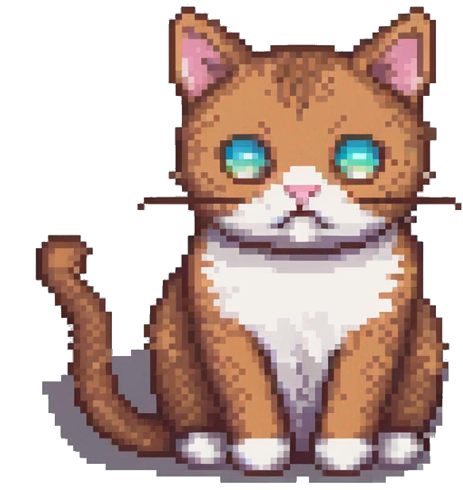

# Chapter 9 · Multimodal Large Language Models

> Chapter goals: Add vision capability to large language models — use CLIP and SBERT for image-text matching, and use BLIP-2 for image captioning and visual question answering.

This chapter corresponds to the official notebook for Chapter 9 of *Hands-On Large Language Models*. Running the examples requires a GPU: in Google Colab select **Runtime > Change runtime type > Hardware accelerator > GPU > GPU type > T4**. To install dependencies, uncomment and run the code block below:

```python
# %%capture
# !pip install matplotlib transformers datasets accelerate sentence-transformers
```

## 9.1 CLIP

CLIP is a multimodal model released by OpenAI that maps images and text into the same vector space, enabling similarity computation between the two.

```python
from urllib.request import urlopen
from PIL import Image

# Load an AI-generated image of a puppy playing in the snow
puppy_path = "https://raw.githubusercontent.com/HandsOnLLM/Hands-On-Large-Language-Models/main/chapter09/images/puppy.png"
image = Image.open(urlopen(puppy_path)).convert("RGB")
caption = "a puppy playing in the snow"
```

```python
image
```

### 9.1.1 Embeddings

Load CLIP's tokenizer, processor, and main model:

```python
from transformers import CLIPTokenizerFast, CLIPProcessor, CLIPModel

model_id = "openai/clip-vit-base-patch32"

# Load a tokenizer to preprocess the text
clip_tokenizer = CLIPTokenizerFast.from_pretrained(model_id)

# Load a processor to preprocess the images
clip_processor = CLIPProcessor.from_pretrained(model_id)

# Main model for generating text and image embeddings
model = CLIPModel.from_pretrained(model_id)
```

Tokenize the text input:

```python
# Tokenize our input
inputs = clip_tokenizer(caption, return_tensors="pt")
inputs
```

Convert the input IDs back to tokens to inspect the tokenization result:

```python
# Convert our input back to tokens
clip_tokenizer.convert_ids_to_tokens(inputs["input_ids"][0])
```

Generate the text embedding and inspect its shape:

```python
# Create a text embedding
text_embedding = model.get_text_features(**inputs)
text_embedding.shape
```

Preprocess the image input:

```python
# Preprocess image
processed_image = clip_processor(
    text=None, images=image, return_tensors='pt'
)['pixel_values']

processed_image.shape
```

Restore the preprocessed image tensor to a visualizable image:

```python
import torch
import numpy as np
import matplotlib.pyplot as plt

# Prepare image for visualization
img = processed_image.squeeze(0)
img = img.permute(*torch.arange(img.ndim - 1, -1, -1))
img = np.einsum('ijk->jik', img)

# Visualize preprocessed image
plt.imshow(img)
plt.axis('off')
```

Generate the image embedding:

```python
# Create the image embedding
image_embedding = model.get_image_features(processed_image)
image_embedding.shape
```

After normalizing both embeddings, compute their dot-product similarity score:

```python
# Normalize the embeddings
text_embedding /= text_embedding.norm(dim=-1, keepdim=True)
image_embedding /= image_embedding.norm(dim=-1, keepdim=True)

# Calculate their similarity
text_embedding = text_embedding.detach().cpu().numpy()
image_embedding = image_embedding.detach().cpu().numpy()
score = text_embedding @ image_embedding.T
score
```

### 9.1.2 More Images

Below are three test images used in this chapter for multimodal input demonstration (a puppy in snow, a pixel cat, and a supercar at sunset):





Load the three images along with their corresponding English captions, and batch-generate image embeddings and text embeddings separately:

```python
from urllib.request import urlopen
from PIL import Image

# Load an AI-generated image of a puppy playing in the snow
cat_path = "https://raw.githubusercontent.com/HandsOnLLM/Hands-On-Large-Language-Models/main/chapter09/images/cat.png"
car_path = "https://raw.githubusercontent.com/HandsOnLLM/Hands-On-Large-Language-Models/main/chapter09/images/car.png"
paths = [puppy_path, cat_path, car_path]
images = [Image.open(urlopen(path)).convert("RGBA") for path in paths]
captions = [
    "a puppy playing in the snow",
    "a pixelated image of a cute cat",
    "A supercar on the road \nwith the sunset in the background"
]

import numpy as np

# Embed all images
image_embeddings = []
for image in images:
  image_processed = clip_processor(images=image, return_tensors='pt')['pixel_values']
  image_embedding = model.get_image_features(image_processed).detach().cpu().numpy()[0]
  image_embeddings.append(image_embedding)
image_embeddings = np.array(image_embeddings)

# Embed all captions
text_embeddings = []
for caption in captions:
  inputs = clip_tokenizer(caption, return_tensors="pt")
  text_emb = model.get_text_features(**inputs).detach().cpu().numpy()[0]
  text_embeddings.append(text_emb)
text_embeddings = np.array(text_embeddings)
```

Compute the cosine similarity matrix between image embeddings and text embeddings:

```python
# Calculate cosine similarity between images and captions
from sklearn.metrics.pairwise import cosine_similarity
sim_matrix = cosine_similarity(image_embeddings, text_embeddings)
```

Visualize the similarity matrix together with the three images:

```python
# Create base figure
plt.figure(figsize=(20, 14))
plt.imshow(sim_matrix, cmap='viridis')

# Adjust ticks with correct labels
plt.yticks(range(len(captions)), captions, fontsize=18)
plt.xticks([])

# Visualize
for i, image in enumerate(images):
    plt.imshow(image, extent=(i - 0.5, i + 0.5, -1.6, -0.6), origin="lower")

# Add the captions at the correct indices
for x in range(sim_matrix.shape[1]):
    for y in range(sim_matrix.shape[0]):
        plt.text(x, y, f"{sim_matrix[y, x]:.2f}", ha="center", va="center", size=30)

# Remove unnecessary spines
for side in ["left", "top", "right", "bottom"]:
  plt.gca().spines[side].set_visible(False)

# Resize blocks
plt.xlim([-0.5, len(captions) - 0.5])
plt.ylim([len(captions) + 0.5, -2])
# plt.title("Similarity Matrix", size=20)
plt.savefig("sim_matrix.png", dpi=300, bbox_inches='tight')
```

## 9.2 SBERT

With the `clip-ViT-B-32` model provided by sentence-transformers, the same image-text matching task can be done more concisely:

```python
from sentence_transformers import SentenceTransformer, util

# Load SBERT-compatible CLIP model
model = SentenceTransformer('clip-ViT-B-32')

# Encode the images
image_embeddings = model.encode(images)

# Encode the captions
text_embeddings = model.encode(captions)

#Compute cosine similarities
sim_matrix = util.cos_sim(image_embeddings, text_embeddings)
print(sim_matrix)
```

## 9.3 BLIP-2

CLIP can only do matching; BLIP-2 builds on top of a vision encoder with an LLM decoder, capable of **generating** text from an image. First load the processor and model (specifying revision to reproduce the book's behavior):

```python
from transformers import AutoProcessor, Blip2ForConditionalGeneration
import torch

# Load processor and main model
blip_processor = AutoProcessor.from_pretrained(
    "Salesforce/blip2-opt-2.7b",
    revision="51572668da0eb669e01a189dc22abe6088589a24"  # Choose specific model because of: https://huggingface.co/Salesforce/blip2-opt-2.7b/discussions/39
)
model = Blip2ForConditionalGeneration.from_pretrained(
    "Salesforce/blip2-opt-2.7b",
    revision="51572668da0eb669e01a189dc22abe6088589a24",
    torch_dtype=torch.float16
)

# Send the model to GPU to speed up inference
device = "cuda" if torch.cuda.is_available() else "cpu"
model.to(device)
```

### 9.3.1 Image Preprocessing

Load the supercar image:

```python
# Load image of a supercar
car_path = "https://raw.githubusercontent.com/HandsOnLLM/Hands-On-Large-Language-Models/main/chapter09/images/car.png"
image = Image.open(urlopen(car_path)).convert("RGB")
image
```

Preprocess the image with the BLIP-2 processor and inspect the pixel tensor shape:

```python
# Preprocess the image
inputs = blip_processor(image, return_tensors="pt").to(device, torch.float16)
inputs["pixel_values"].shape
```

Restore the preprocessed pixel values to the 0–255 RGB range for manual inspection:

```python
from sklearn.preprocessing import MinMaxScaler

# Convert to numpy and go from (1, 3, 224, 224) to (224, 224, 3) in shape
image_inputs = inputs["pixel_values"][0].detach().cpu().numpy()
image_inputs = np.einsum('ijk->kji', image_inputs)
image_inputs = np.einsum('ijk->jik', image_inputs)

# Scale image inputs to 0-255 to represent RGB values
scaler = MinMaxScaler(feature_range=(0, 255))
image_inputs = scaler.fit_transform(image_inputs.reshape(-1, image_inputs.shape[-1])).reshape(image_inputs.shape)
image_inputs = np.array(image_inputs, dtype=np.uint8)

# Convert numpy array to Image
Image.fromarray(image_inputs)
```

### 9.3.2 Text Preprocessing

Inspect the tokenizer used internally by BLIP-2:

```python
blip_processor.tokenizer
```

Tokenize the text and convert back to tokens to observe (note the `Ġ` prefix indicates a leading space):

```python
# Preprocess the text
text = "Her vocalization was remarkably melodic"
token_ids = blip_processor(image, text=text, return_tensors="pt")
token_ids = token_ids.to(device, torch.float16)["input_ids"][0]

# Convert input ids back to tokens
tokens = blip_processor.tokenizer.convert_ids_to_tokens(token_ids)
tokens
```

Replace the space token with an underscore for readability:

```python
# Replace the space token with an underscore
tokens = [token.replace("Ġ", "_") for token in tokens]
tokens
```

### 9.3.3 Use Case 1: Image Captioning

Input the supercar image and preprocess:

```python
# Load an AI-generated image of a supercar
image = Image.open(urlopen(car_path)).convert("RGB")

# Convert an image into inputs and preprocess it
inputs = blip_processor(image, return_tensors="pt").to(device, torch.float16)
image
```

Generate caption text:

```python
# Generate image ids to be passed to the decoder (LLM)
generated_ids = model.generate(**inputs, max_new_tokens=20)

# Generate text from the image ids
generated_text = blip_processor.batch_decode(generated_ids, skip_special_tokens=True)
generated_text = generated_text[0].strip()
generated_text
```

Switch to a Rorschach inkblot image to test the model's performance:

```python
url = "https://upload.wikimedia.org/wikipedia/commons/7/70/Rorschach_blot_01.jpg"
image = Image.open(urlopen(url)).convert("RGB")
image
```

```python
# Load rorschach image
url = "https://upload.wikimedia.org/wikipedia/commons/7/70/Rorschach_blot_01.jpg"
image = Image.open(urlopen(url)).convert("RGB")

# Generate caption
inputs = blip_processor(image, return_tensors="pt").to(device, torch.float16)
generated_ids = model.generate(**inputs, max_new_tokens=20)
generated_text = blip_processor.batch_decode(generated_ids, skip_special_tokens=True)
generated_text = generated_text[0].strip()
generated_text
```

### 9.3.4 Use Case 2: Visual Question Answering

BLIP-2 can perform image-based Q&A via prompts in the "Question: ... Answer:" format:

```python
# Load an AI-generated image of a supercar
image = Image.open(urlopen(car_path)).convert("RGB")
```

```python
# Visual Question Answering
prompt = "Question: Write down what you see in this picture. Answer:"

# Process both the image and the prompt
inputs = blip_processor(image, text=prompt, return_tensors="pt").to(device, torch.float16)

# Generate text
generated_ids = model.generate(**inputs, max_new_tokens=30)
generated_text = blip_processor.batch_decode(generated_ids, skip_special_tokens=True)
generated_text = generated_text[0].strip()
generated_text
```

Concatenating the question-answer history into the prompt enables multi-turn conversational behavior:

```python
# Chat-like prompting
prompt = "Question: Write down what you see in this picture. Answer: A sports car driving on the road at sunset. Question: What would it cost me to drive that car? Answer:"

# Generate output
inputs = blip_processor(image, text=prompt, return_tensors="pt").to(device, torch.float16)
generated_ids = model.generate(**inputs, max_new_tokens=30)
generated_text = blip_processor.batch_decode(generated_ids, skip_special_tokens=True)
generated_text = generated_text[0].strip()
generated_text
```

Finally, the official notebook provides an interactive chat box based on ipywidgets: maintain a `memory` list holding the question-answer history, and each time a question is asked, concatenate the full history into the prompt before generating the answer.

```python
from IPython.display import HTML, display
import ipywidgets as widgets

def text_eventhandler(*args):
  question = args[0]["new"]
  if question:
    args[0]["owner"].value = ""

    # Create prompt
    if not memory:
      prompt = " Question: " + question + " Answer:"
    else:
      template = "Question: {} Answer: {}."
      prompt = " ".join(
          [
              template.format(memory[i][0], memory[i][1])
              for i in range(len(memory))
          ]
      ) + " Question: " + question + " Answer:"

    # Generate text
    inputs = blip_processor(image, text=prompt, return_tensors="pt")
    inputs = inputs.to(device, torch.float16)
    generated_ids = model.generate(**inputs, max_new_tokens=100)
    generated_text = blip_processor.batch_decode(
        generated_ids,
        skip_special_tokens=True
    )
    generated_text = generated_text[0].strip().split("Question")[0]

    # Update memory
    memory.append((question, generated_text))

    # Assign to output
    output.append_display_data(HTML("<b>USER:</b> " + question))
    output.append_display_data(HTML("<b>BLIP-2:</b> " + generated_text))
    output.append_display_data(HTML("<br>"))

# Prepare widgets
in_text = widgets.Text()
in_text.continuous_update = False
in_text.observe(text_eventhandler, "value")
output = widgets.Output()
memory = []

# Display chat box
display(
    widgets.VBox(
        children=[output, in_text],
        layout=widgets.Layout(display="inline-flex", flex_flow="column-reverse"),
    )
)
```

```python

```

## 9.4 Chapter Summary

- CLIP encodes images and text into the same vector space; after normalization, dot product / cosine similarity completes image-text matching;
- `clip-vit-base-patch32` text embeddings and image embeddings have the same shape, enabling pairwise similarity matrix computation and visualization;
- `clip-ViT-B-32` from sentence-transformers completes image and text vectorization in a single `encode()` call;
- BLIP-2 = vision encoder + Q-Former + LLM decoder, supporting both image captioning and visual question answering;
- By prepending "Question: ... Answer:" to the prompt and concatenating the question-answer history, BLIP-2 can exhibit multi-turn conversational ability.

<Quiz :items="quiz" />

## 🛠️ Hands-on Practice

1. Replace the three test images with three images you take or generate yourself, along with corresponding English captions; rerun the similarity matrix visualization from Section 9.1.2; observe which pairings score lower than expected and analyze the reasons.
2. Following Section 9.3.3, record the description text BLIP-2 outputs for the Rorschach image; then rerun with different `max_new_tokens` values (10, 20, 50) and compare how description length and quality change.
3. Extend the interactive chat box in Section 9.3.4: when the `memory` list exceeds 5 entries, keep only the most recent 5 before concatenating the prompt; test whether the model's responses become more stable over long conversations.

<script setup>
const quiz = [
  {
    question: 'What is the core capability of the CLIP model?',
    options: [
      'Generate images only',
      'Map images and text into the same vector space to compute similarity',
      'Only perform text classification',
      'Replace the tokenizer'
    ],
    answer: 1,
    explain: 'CLIP encodes images and text into the same vector space; after normalization, dot product / cosine similarity measures the image-text matching degree.'
  },
  {
    question: 'Which CLIP model checkpoint is used in this chapter?',
    options: [
      'openai/clip-vit-base-patch32',
      'Salesforce/blip2-opt-2.7b',
      'bert-base-uncased',
      'clip-ViT-L-14'
    ],
    answer: 0,
    explain: 'Section 9.1 loads openai/clip-vit-base-patch32; Salesforce/blip2-opt-2.7b is the BLIP-2 model.'
  },
  {
    question: 'In BLIP-2 tokens, what does the Ġ prefix represent?',
    options: [
      'End of sentence',
      'A special separator',
      'Leading space',
      'Unknown word token'
    ],
    answer: 2,
    explain: 'When replacing the space token with an underscore in the notebook, the Ġ prefix is what is handled — it represents a leading space.'
  },
  {
    question: 'How does BLIP-2实现 multi-turn visual conversation?',
    options: [
      'The model has a built-in memory module that auto-saves history',
      'Concatenate historical Q&A pairs in Question/Answer format into the prompt before generating',
      'Retrain the model each time',
      'Use a larger image resolution'
    ],
    answer: 1,
    explain: 'The interactive chat box maintains a memory list; each time a question is asked, the historical Q&A is concatenated into the prompt passed to the processor and model.'
  }
]
</script>
