# 扩展阅读 · Bonus Material

> 本章对应仓库 `bonus/` 目录。图书篇幅有限（约 400 页），作者以同样的**视觉化、图解风格**在书外持续产出深度指南。以下 8 篇内容均已收录配图，点击标题可跳转原文。

## 1. How Transformer LLMs Work（DeepLearning.AI 课程）

*深化全书内容*

作者与 DeepLearning.AI 合作，把书中核心内容改造成一门短课程，讲解 Transformer LLM 的主要组成部分。这门**高度动画化**的课程能进一步增强你对书中内容的直觉。

<a href="https://www.deeplearning.ai/short-courses/how-transformer-llms-work/">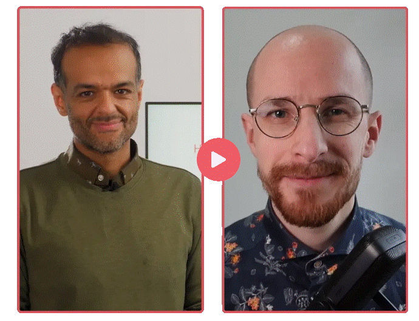</a>

你将学到：tokenization、embeddings、self-attention 与 transformer blocks 等关键组件；KV cache、multi-query attention、grouped-query attention、sparse attention 等近期注意力机制改进；对比现代 LLM 的分词策略并在 Hugging Face Transformers 库中探索 transformer。

## 2. A Visual Guide to Quantization（量化可视化指南）

*扩展第 7 章与第 12 章*

书中介绍了 quantization 的概念，以及它如何降低训练与微调的计算需求。[A Visual Guide to Quantization](https://newsletter.maartengrootendorst.com/p/a-visual-guide-to-quantization) 在书的基础上深入技术细节：

<a href="https://newsletter.maartengrootendorst.com/p/a-visual-guide-to-quantization">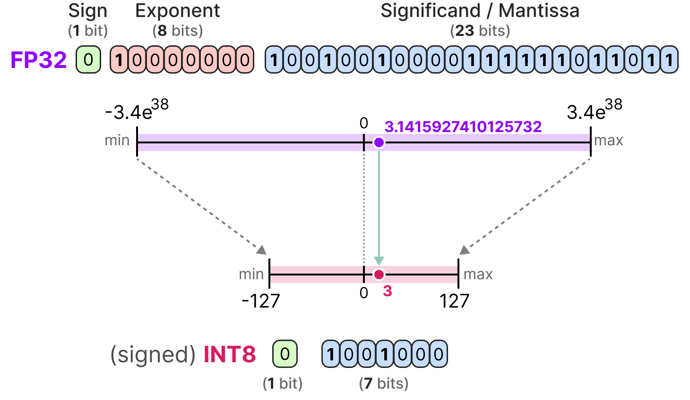</a>

指南探讨了多种量化方法——post-training quantization 与 quantization-aware training，甚至展示了 BitNet：一种能得到三值参数（只有 3 个取值！）的方法。

<a href="https://newsletter.maartengrootendorst.com/p/a-visual-guide-to-quantization">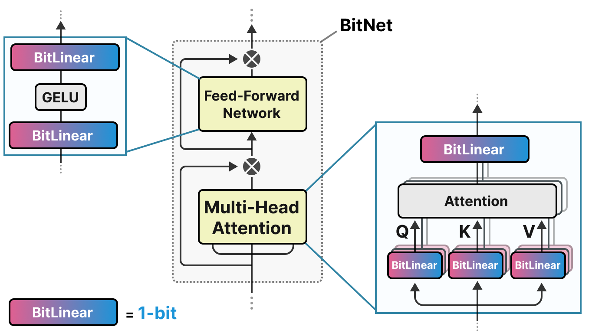</a>

## 3. A Visual Guide to Mamba and State Space Models

*第 3 章的「替代」阅读*

不是扩展而是「替换」第 3 章！[该指南](https://newsletter.maartengrootendorst.com/p/a-visual-guide-to-mamba-and-state)提供了与第 3 章 decoder-only Transformer 完全不同的序列建模思路——State Space Models：

这个领域并非只有 Transformer，激动人心的混合架构甚至开始[组合 Transformer 块与 Mamba 块](https://www.ai21.com/blog/announcing-jamba)。

<a href="https://newsletter.maartengrootendorst.com/p/a-visual-guide-to-mamba-and-state">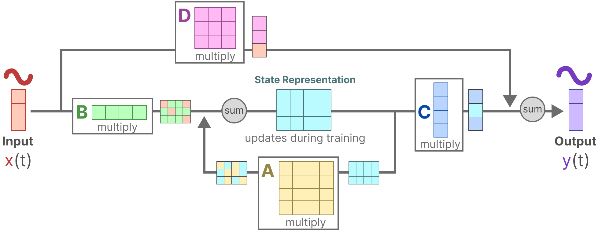</a>

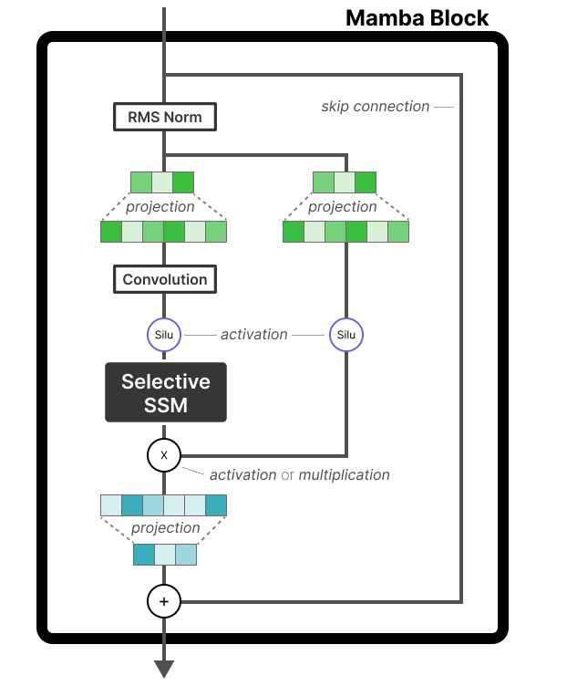

## 4. A Visual Guide to Mixture of Experts (MoE)

*扩展第 3 章*

第 3 章为传统 Transformer decoder 打下基础，也涵盖了 efficient attention 与位置嵌入的进展。有一个未详细展开、但日益重要的技术就是 **Mixture of Experts**——通过引入多个专精子网络（「专家」）来增强 Transformer decoder：

[MoE 可视化指南](https://newsletter.maartengrootendorst.com/p/a-visual-guide-to-mixture-of-experts)讲解了 MoE 模型如何把不同输入动态路由给最合适的专家，从而更高效地处理多样化语言任务；后续还延伸到视觉语言模型领域：

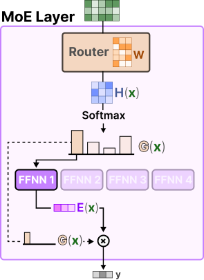

## 5. The Illustrated Stable Diffusion

*扩展第 9 章*

第 9 章介绍 Vision Transformer (ViT)，并演示 CLIP 如何让文本与图像联合建模——把图像带入文本模型，使其能对图像进行「推理」。而 CLIP 也能反向使用：把文本带入视觉模型，用文字引导图像生成。

[The Illustrated Stable Diffusion](https://jalammar.github.io/illustrated-stable-diffusion/) 以一贯的高度视觉化方式探讨 CLIP 在 Stable Diffusion 中的角色：

它进一步剖析 Stable Diffusion 的内部工作原理——如何结合 CLIP 的能力与先进的扩散模型，从文本提示生成高质量图像：

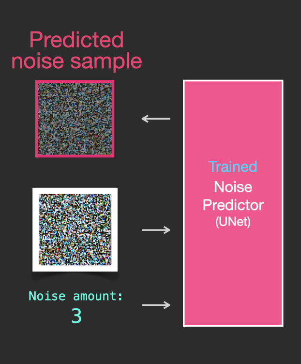

## 6. A Visual Guide to Reasoning LLMs

*扩展第 6 章与第 12 章*

书中讲过 chain-of-thought 通过延长推理提升输出质量。[A Visual Guide to Reasoning LLMs](https://newsletter.maartengrootendorst.com/p/a-visual-guide-to-reasoning-llms) 更进一步：描述了从 **train-time compute**（更多数据、更长训练、更大模型）到 **test-time compute**（通过「推理」延长推断）的范式转变：

指南探索了训练期与推理期的多种推理蒸馏技术，并专门介绍了 2024 年极具影响力的模型 DeepSeek-R1：

<a href="https://newsletter.maartengrootendorst.com/p/a-visual-guide-to-reasoning-llms">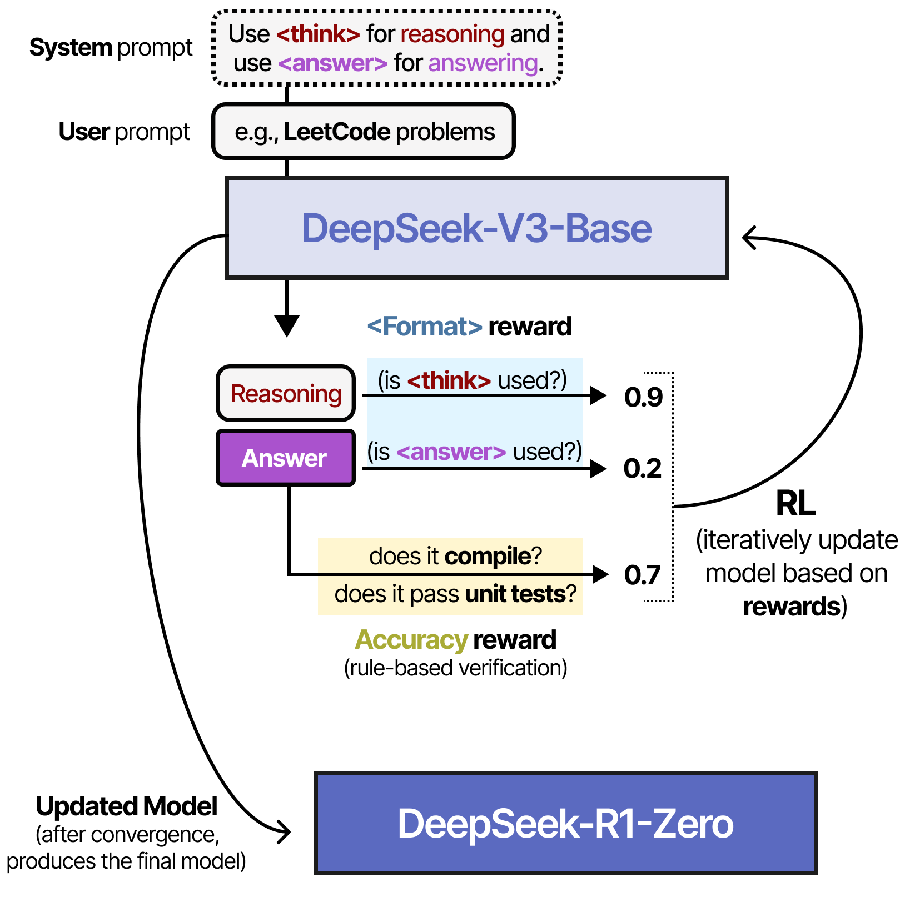</a>

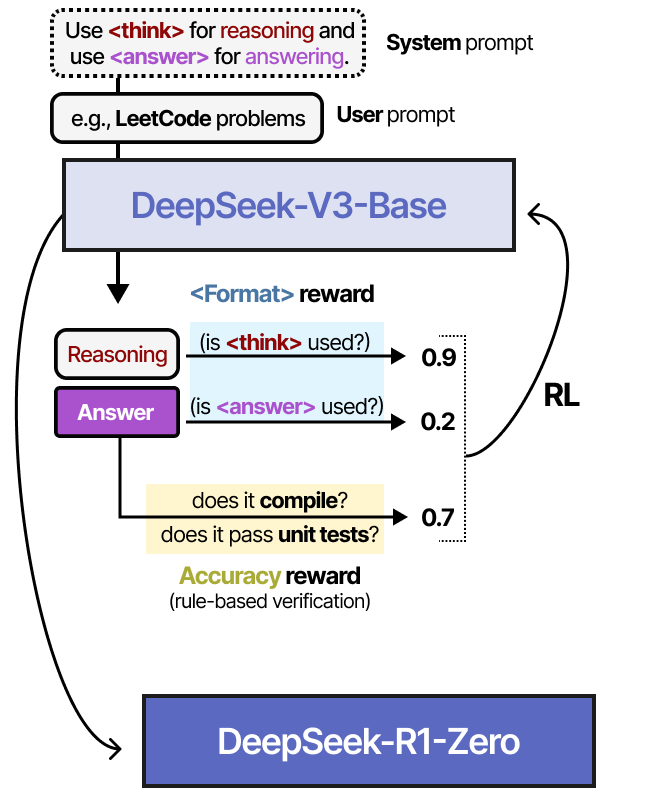

## 7. The Illustrated DeepSeek-R1

*扩展第 12 章*

第 12 章讲解了创建与微调模型的常见技术——language modeling、supervised fine-tuning 与 preference tuning，聚焦非推理模型。DeepSeek-R1 则是意外发布的推理型 LLM，作为开放权重模型媲美 OpenAI o1。

[The Illustrated DeepSeek-R1](https://newsletter.languagemodels.co/p/the-illustrated-deepseek-r1/) 剖析了该模型及其训练过程。有趣的是，它使用基于规则的验证器确保推理过程遵循特定标准，比如确认代码真的可以编译：

<a href="https://newsletter.languagemodels.co/p/the-illustrated-deepseek-r1/">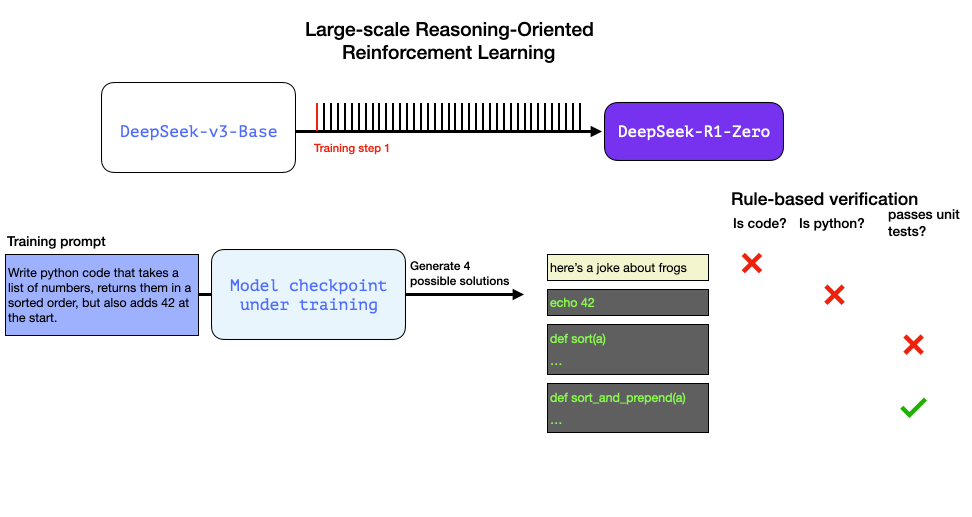</a>

其架构是 [Mixture-of-Experts](#4-a-visual-guide-to-mixture-of-experts-moe)，拥有 256 个专家（每次激活 8 个），规模相当庞大：

<a href="https://newsletter.languagemodels.co/p/the-illustrated-deepseek-r1/">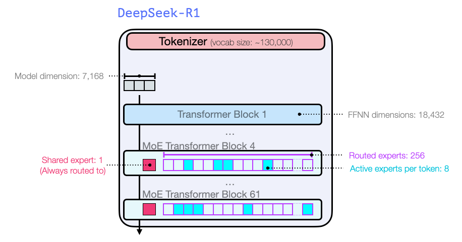</a>

## 8. A Visual Guide to LLM Agents

*扩展第 7 章与第 8 章*

第 7、8 章展示了如何通过给 LLM 工具、记忆等来扩展其能力，并简述了实现自主行为的方法论（如 Reason and Act, ReAct）。[A Visual Guide to LLM Agents](https://newsletter.maartengrootendorst.com/p/a-visual-guide-to-llm-agents) 深入讲解如何让 LLM 自主行动（即 Agent）：

先总览 Agent 的主要组件……

……再逐一详解三大组件：**tools**、**memory** 与 **planning**：

工具部分深入探讨了 **Model Context Protocol** (MCP)——展示这一日益流行的 Agent 工具使用标准：

<a href="https://newsletter.maartengrootendorst.com/p/a-visual-guide-to-llm-agents">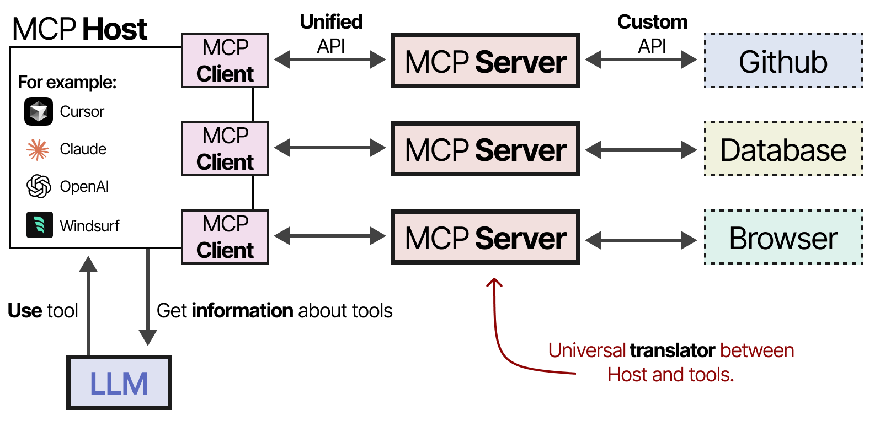</a>

**Planning** 是本指南的核心，它是使 LLM Agent 获得自主行为的主要组件：

实现自主行为只是第一步，指南最后描述了多 Agent 协作——多个 Agent 共同完成预定目标：

