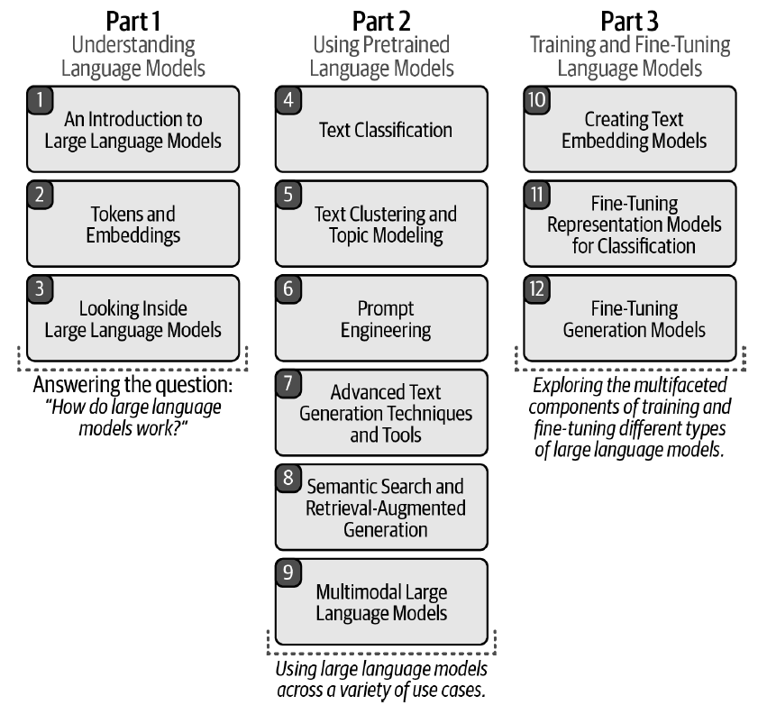

# 第 1 章 · 语言模型导论

> 本章目标：探索激动人心的 Language AI 领域，加载并运行你的第一个语言模型 Phi-3，完成一次文本生成。

## 1.1 关于本章与本书

本章是《Hands-On Large Language Models》（Jay Alammar 与 Maarten Grootendorst 著，O'Reilly 出版）第 1 章的配套笔记本。全书用大量可视化插图讲解 LLM 的内部原理与实践：


*上图为本书封面。*

全书共 12 章，从 Token 与嵌入讲起，逐步深入分类、聚类、提示工程、语义搜索、多模态与微调：



*上图为全书 12 章结构总览。*

你也可以在 Google Colab 中打开本章原始笔记本运行：[Open In Colab](https://colab.research.google.com/github/HandsOnLLM/Hands-On-Large-Language-Models/blob/main/chapter01/Chapter%201%20-%20Introduction%20to%20Language%20Models.ipynb)。

## 1.2 [可选] 在 Colab 中安装依赖

如果你在 Google Colab（或任何其他云厂商）上查看本笔记本，需要**取消注释并运行**下面的代码块来安装本章依赖：

```python
# %%capture
# !pip install transformers==4.41.2 accelerate==0.31.0
```

💡 **注意**：我们需要 GPU 来运行本笔记本中的示例。在 Google Colab 中，依次进入
**Runtime > Change runtime type > Hardware accelerator > GPU > GPU type > T4**。

## 1.3 Phi-3：加载模型与分词器

第一步是把模型加载到 GPU 上以获得更快的推理速度。注意我们分别加载模型和分词器（尽管这并非总是必需）。

```python
from transformers import AutoModelForCausalLM, AutoTokenizer

# Load model and tokenizer
model = AutoModelForCausalLM.from_pretrained(
    "microsoft/Phi-3-mini-4k-instruct",
    device_map="cuda",
    torch_dtype="auto",
    trust_remote_code=False,
)
tokenizer = AutoTokenizer.from_pretrained("microsoft/Phi-3-mini-4k-instruct")
```

## 1.4 用 pipeline 封装生成器

虽然现在可以直接使用模型和分词器，但把它们包装进一个 `pipeline` 对象会方便得多：

```python
from transformers import pipeline

# Create a pipeline
generator = pipeline(
    "text-generation",
    model=model,
    tokenizer=tokenizer,
    return_full_text=False,
    max_new_tokens=500,
    do_sample=False
)
```

## 1.5 第一次对话：让模型讲个笑话

最后，我们以 user 身份创建提示词并交给模型：

```python
# The prompt (user input / query)
messages = [
    {"role": "user", "content": "Create a funny joke about chickens."}
]

# Generate output
output = generator(messages)
print(output[0]["generated_text"])
```

模型会返回一段关于鸡的笑话文本。`messages` 采用对话角色格式（`role` + `content`），`return_full_text=False` 表示只返回新生成的部分而不包含输入提示词。

## 1.6 本章小结

- 《Hands-On Large Language Models》全书 12 章，从 Token 嵌入到微调生成模型层层递进；
- 使用 `AutoModelForCausalLM` 与 `AutoTokenizer` 分别加载模型与分词器（示例为 `microsoft/Phi-3-mini-4k-instruct`），并通过 `device_map="cuda"` 放到 GPU 上；
- `pipeline("text-generation", ...)` 是最便捷的推理封装，`max_new_tokens=500` 控制生成长度，`do_sample=False` 表示贪心解码；
- 对话式输入使用 `messages` 列表，每条消息包含 `role` 与 `content` 字段；
- 运行示例需要 GPU（如 Colab 的 T4）。

<Quiz :items="quiz" />

## 🛠️ 动手实践

1. 按 1.2 节安装依赖后，在 GPU 环境（本地或 Colab T4）中完整运行 1.3–1.5 节代码，把 `messages` 中的提示词换成中文问题，观察模型输出。
2. 将 `pipeline` 的 `do_sample=True` 并添加 `temperature=0.7` 参数重新生成笑话，对比贪心解码（`do_sample=False`）与采样解码两次输出的差异。
3. 把 `max_new_tokens` 分别改为 50 和 500 各运行一次，记录生成长度的变化，并解释 `return_full_text=False` 与 `True` 时输出的区别。

<script setup>
const quiz = [
  {
    question: '本章用于加载预训练语言模型的核心类是？',
    options: [
      'AutoModelForCausalLM',
      'AutoModelForMaskedLM',
      'BertForSequenceClassification',
      'SentenceTransformer'
    ],
    answer: 0,
    explain: '本章通过 AutoModelForCausalLM.from_pretrained 加载 microsoft/Phi-3-mini-4k-instruct 因果语言模型。'
  },
  {
    question: 'pipeline 构造参数中 return_full_text=False 的作用是？',
    options: [
      '禁止模型输出任何文本',
      '只返回新生成的文本，不包含输入提示词',
      '返回完整的输入提示词',
      '把输出截断为 500 个字符'
    ],
    answer: 1,
    explain: 'return_full_text=False 让 pipeline 只返回新生成部分；若为 True 则输出会带上输入提示词本身。'
  },
  {
    question: '关于 messages 列表的格式，下列说法正确的是？',
    options: [
      '它是一个纯字符串列表',
      '每条消息是包含 role 和 content 两个键的字典',
      '必须至少包含 system、user、assistant 三条消息',
      '它的键名是 speaker 和 text'
    ],
    answer: 1,
    explain: '本章示例 messages = [{"role": "user", "content": "..."}]，采用 role/content 键值对表示对话消息。'
  },
  {
    question: '在 Google Colab 上运行本章示例时，官方建议的硬件配置是？',
    options: [
      'CPU runtime 即可',
      'TPU v3-8',
      'GPU 硬件加速器（T4）',
      '必须使用本地 A100'
    ],
    answer: 2,
    explain: '本章 NOTE 指出需要在 Runtime > Change runtime type 中选择 Hardware accelerator 为 GPU（T4）。'
  }
]
</script>
