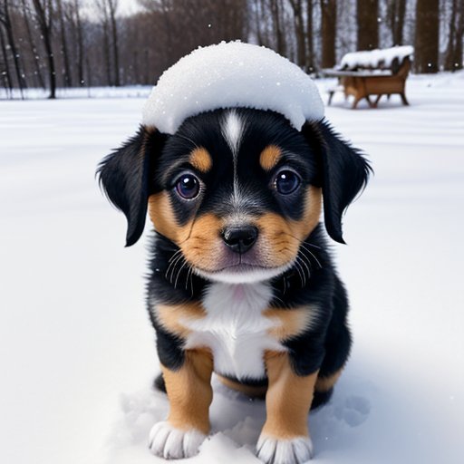

# 第 9 章 · 多模态大语言模型

> 本章目标：为大型语言模型添加视觉能力——使用 CLIP 与 SBERT 进行图文匹配，并用 BLIP-2 实现图像描述生成与视觉问答。

本章对应《Hands-On Large Language Models》第 9 章官方笔记本。运行示例需要 GPU：在 Google Colab 中选择 **Runtime > Change runtime type > Hardware accelerator > GPU > GPU type > T4**。如需安装依赖，取消注释并运行以下代码块：

```python
# %%capture
# !pip install matplotlib transformers datasets accelerate sentence-transformers
```

## 9.1 CLIP

CLIP 是 OpenAI 发布的多模态模型，能将图像与文本映射到同一向量空间，从而计算二者的相似度。

```python
from urllib.request import urlopen
from PIL import Image

# Load an AI-generated image of a puppy playing in the snow
puppy_path = "https://raw.githubusercontent.com/HandsOnLLM/Hands-On-Large-Language-Models/main/chapter09/images/puppy.png"
image = Image.open(urlopen(puppy_path)).convert("RGB")
caption = "a puppy playing in the snow"
```

```python
image
```

### 9.1.1 嵌入（Embeddings）

加载 CLIP 的 tokenizer、processor 与主模型：

```python
from transformers import CLIPTokenizerFast, CLIPProcessor, CLIPModel

model_id = "openai/clip-vit-base-patch32"

# Load a tokenizer to preprocess the text
clip_tokenizer = CLIPTokenizerFast.from_pretrained(model_id)

# Load a processor to preprocess the images
clip_processor = CLIPProcessor.from_pretrained(model_id)

# Main model for generating text and image embeddings
model = CLIPModel.from_pretrained(model_id)
```

对文本输入进行分词：

```python
# Tokenize our input
inputs = clip_tokenizer(caption, return_tensors="pt")
inputs
```

把输入 ID 转回 token 查看分词结果：

```python
# Convert our input back to tokens
clip_tokenizer.convert_ids_to_tokens(inputs["input_ids"][0])
```

生成文本嵌入并查看其形状：

```python
# Create a text embedding
text_embedding = model.get_text_features(**inputs)
text_embedding.shape
```

预处理图像输入：

```python
# Preprocess image
processed_image = clip_processor(
    text=None, images=image, return_tensors='pt'
)['pixel_values']

processed_image.shape
```

将预处理后的图像张量还原为可视化图像：

```python
import torch
import numpy as np
import matplotlib.pyplot as plt

# Prepare image for visualization
img = processed_image.squeeze(0)
img = img.permute(*torch.arange(img.ndim - 1, -1, -1))
img = np.einsum('ijk->jik', img)

# Visualize preprocessed image
plt.imshow(img)
plt.axis('off')
```

生成图像嵌入：

```python
# Create the image embedding
image_embedding = model.get_image_features(processed_image)
image_embedding.shape
```

归一化两种嵌入后计算点积相似度得分：

```python
# Normalize the embeddings
text_embedding /= text_embedding.norm(dim=-1, keepdim=True)
image_embedding /= image_embedding.norm(dim=-1, keepdim=True)

# Calculate their similarity
text_embedding = text_embedding.detach().cpu().numpy()
image_embedding = image_embedding.detach().cpu().numpy()
score = text_embedding @ image_embedding.T
score
```

### 9.1.2 更多图片

下面是本章用于多模态输入演示的三张测试图片（雪地小狗、像素猫与夕阳跑车）：




加载三张图片及其对应的英文描述，并分别批量生成图像嵌入与文本嵌入：

```python
from urllib.request import urlopen
from PIL import Image

# Load an AI-generated image of a puppy playing in the snow
cat_path = "https://raw.githubusercontent.com/HandsOnLLM/Hands-On-Large-Language-Models/main/chapter09/images/cat.png"
car_path = "https://raw.githubusercontent.com/HandsOnLLM/Hands-On-Large-Language-Models/main/chapter09/images/car.png"
paths = [puppy_path, cat_path, car_path]
images = [Image.open(urlopen(path)).convert("RGBA") for path in paths]
captions = [
    "a puppy playing in the snow",
    "a pixelated image of a cute cat",
    "A supercar on the road \nwith the sunset in the background"
]

import numpy as np

# Embed all images
image_embeddings = []
for image in images:
  image_processed = clip_processor(images=image, return_tensors='pt')['pixel_values']
  image_embedding = model.get_image_features(image_processed).detach().cpu().numpy()[0]
  image_embeddings.append(image_embedding)
image_embeddings = np.array(image_embeddings)

# Embed all captions
text_embeddings = []
for caption in captions:
  inputs = clip_tokenizer(caption, return_tensors="pt")
  text_emb = model.get_text_features(**inputs).detach().cpu().numpy()[0]
  text_embeddings.append(text_emb)
text_embeddings = np.array(text_embeddings)
```

计算图像嵌入与文本嵌入之间的余弦相似度矩阵：

```python
# Calculate cosine similarity between images and captions
from sklearn.metrics.pairwise import cosine_similarity
sim_matrix = cosine_similarity(image_embeddings, text_embeddings)
```

将相似度矩阵与三张图片一起可视化：

```python
# Create base figure
plt.figure(figsize=(20, 14))
plt.imshow(sim_matrix, cmap='viridis')

# Adjust ticks with correct labels
plt.yticks(range(len(captions)), captions, fontsize=18)
plt.xticks([])

# Visualize
for i, image in enumerate(images):
    plt.imshow(image, extent=(i - 0.5, i + 0.5, -1.6, -0.6), origin="lower")

# Add the captions at the correct indices
for x in range(sim_matrix.shape[1]):
    for y in range(sim_matrix.shape[0]):
        plt.text(x, y, f"{sim_matrix[y, x]:.2f}", ha="center", va="center", size=30)

# Remove unnecessary spines
for side in ["left", "top", "right", "bottom"]:
  plt.gca().spines[side].set_visible(False)

# Resize blocks
plt.xlim([-0.5, len(captions) - 0.5])
plt.ylim([len(captions) + 0.5, -2])
# plt.title("Similarity Matrix", size=20)
plt.savefig("sim_matrix.png", dpi=300, bbox_inches='tight')
```

## 9.2 SBERT

借助 sentence-transformers 提供的 `clip-ViT-B-32` 模型，可以更简洁地完成同样的图文匹配任务：

```python
from sentence_transformers import SentenceTransformer, util

# Load SBERT-compatible CLIP model
model = SentenceTransformer('clip-ViT-B-32')

# Encode the images
image_embeddings = model.encode(images)

# Encode the captions
text_embeddings = model.encode(captions)

#Compute cosine similarities
sim_matrix = util.cos_sim(image_embeddings, text_embeddings)
print(sim_matrix)
```

## 9.3 BLIP-2

CLIP 只能做匹配；BLIP-2 则在视觉编码器之上接入了 LLM 解码器，能够根据图像**生成**文本。先加载处理器与模型（指定 revision 以复现书中行为）：

```python
from transformers import AutoProcessor, Blip2ForConditionalGeneration
import torch

# Load processor and main model
blip_processor = AutoProcessor.from_pretrained(
    "Salesforce/blip2-opt-2.7b",
    revision="51572668da0eb669e01a189dc22abe6088589a24"  # Choose specific model because of: https://huggingface.co/Salesforce/blip2-opt-2.7b/discussions/39
)
model = Blip2ForConditionalGeneration.from_pretrained(
    "Salesforce/blip2-opt-2.7b",
    revision="51572668da0eb669e01a189dc22abe6088589a24",
    torch_dtype=torch.float16
)

# Send the model to GPU to speed up inference
device = "cuda" if torch.cuda.is_available() else "cpu"
model.to(device)
```

### 9.3.1 图像预处理

加载超级跑车图片：

```python
# Load image of a supercar
car_path = "https://raw.githubusercontent.com/HandsOnLLM/Hands-On-Large-Language-Models/main/chapter09/images/car.png"
image = Image.open(urlopen(car_path)).convert("RGB")
image
```

用 BLIP-2 处理器预处理图像并查看像素张量形状：

```python
# Preprocess the image
inputs = blip_processor(image, return_tensors="pt").to(device, torch.float16)
inputs["pixel_values"].shape
```

把预处理后的像素值还原到 0–255 的 RGB 区间以便人工检查：

```python
from sklearn.preprocessing import MinMaxScaler

# Convert to numpy and go from (1, 3, 224, 224) to (224, 224, 3) in shape
image_inputs = inputs["pixel_values"][0].detach().cpu().numpy()
image_inputs = np.einsum('ijk->kji', image_inputs)
image_inputs = np.einsum('ijk->jik', image_inputs)

# Scale image inputs to 0-255 to represent RGB values
scaler = MinMaxScaler(feature_range=(0, 255))
image_inputs = scaler.fit_transform(image_inputs.reshape(-1, image_inputs.shape[-1])).reshape(image_inputs.shape)
image_inputs = np.array(image_inputs, dtype=np.uint8)

# Convert numpy array to Image
Image.fromarray(image_inputs)
```

### 9.3.2 文本预处理

查看 BLIP-2 内部使用的 tokenizer：

```python
blip_processor.tokenizer
```

对文本进行分词并转回 token 观察（注意 `Ġ` 前缀表示词首空格）：

```python
# Preprocess the text
text = "Her vocalization was remarkably melodic"
token_ids = blip_processor(image, text=text, return_tensors="pt")
token_ids = token_ids.to(device, torch.float16)["input_ids"][0]

# Convert input ids back to tokens
tokens = blip_processor.tokenizer.convert_ids_to_tokens(token_ids)
tokens
```

把空格 token 替换为下划线以便阅读：

```python
# Replace the space token with an underscore
tokens = [token.replace("Ġ", "_") for token in tokens]
tokens
```

### 9.3.3 用例一：图像描述生成（Image Captioning）

输入跑车图片并预处理：

```python
# Load an AI-generated image of a supercar
image = Image.open(urlopen(car_path)).convert("RGB")

# Convert an image into inputs and preprocess it
inputs = blip_processor(image, return_tensors="pt").to(device, torch.float16)
image
```

生成描述文本：

```python
# Generate image ids to be passed to the decoder (LLM)
generated_ids = model.generate(**inputs, max_new_tokens=20)

# Generate text from the image ids
generated_text = blip_processor.batch_decode(generated_ids, skip_special_tokens=True)
generated_text = generated_text[0].strip()
generated_text
```

换一张罗夏墨迹图测试模型的表现：

```python
url = "https://upload.wikimedia.org/wikipedia/commons/7/70/Rorschach_blot_01.jpg"
image = Image.open(urlopen(url)).convert("RGB")
image
```

```python
# Load rorschach image
url = "https://upload.wikimedia.org/wikipedia/commons/7/70/Rorschach_blot_01.jpg"
image = Image.open(urlopen(url)).convert("RGB")

# Generate caption
inputs = blip_processor(image, return_tensors="pt").to(device, torch.float16)
generated_ids = model.generate(**inputs, max_new_tokens=20)
generated_text = blip_processor.batch_decode(generated_ids, skip_special_tokens=True)
generated_text = generated_text[0].strip()
generated_text
```

### 9.3.4 用例二：视觉问答（Visual Question Answering）

BLIP-2 可以通过「Question: ... Answer:」格式的提示实现看图问答：

```python
# Load an AI-generated image of a supercar
image = Image.open(urlopen(car_path)).convert("RGB")
```

```python
# Visual Question Answering
prompt = "Question: Write down what you see in this picture. Answer:"

# Process both the image and the prompt
inputs = blip_processor(image, text=prompt, return_tensors="pt").to(device, torch.float16)

# Generate text
generated_ids = model.generate(**inputs, max_new_tokens=30)
generated_text = blip_processor.batch_decode(generated_ids, skip_special_tokens=True)
generated_text = generated_text[0].strip()
generated_text
```

把历史问答拼接进提示即可实现多轮对话效果：

```python
# Chat-like prompting
prompt = "Question: Write down what you see in this picture. Answer: A sports car driving on the road at sunset. Question: What would it cost me to drive that car? Answer:"

# Generate output
inputs = blip_processor(image, text=prompt, return_tensors="pt").to(device, torch.float16)
generated_ids = model.generate(**inputs, max_new_tokens=30)
generated_text = blip_processor.batch_decode(generated_ids, skip_special_tokens=True)
generated_text = generated_text[0].strip()
generated_text
```

最后，官方笔记本还提供了一个基于 ipywidgets 的交互式聊天框：维护一个 `memory` 列表保存历史问答，每次提问时把全部历史拼进提示再生成回答。

```python
from IPython.display import HTML, display
import ipywidgets as widgets

def text_eventhandler(*args):
  question = args[0]["new"]
  if question:
    args[0]["owner"].value = ""

    # Create prompt
    if not memory:
      prompt = " Question: " + question + " Answer:"
    else:
      template = "Question: {} Answer: {}."
      prompt = " ".join(
          [
              template.format(memory[i][0], memory[i][1])
              for i in range(len(memory))
          ]
      ) + " Question: " + question + " Answer:"

    # Generate text
    inputs = blip_processor(image, text=prompt, return_tensors="pt")
    inputs = inputs.to(device, torch.float16)
    generated_ids = model.generate(**inputs, max_new_tokens=100)
    generated_text = blip_processor.batch_decode(
        generated_ids,
        skip_special_tokens=True
    )
    generated_text = generated_text[0].strip().split("Question")[0]

    # Update memory
    memory.append((question, generated_text))

    # Assign to output
    output.append_display_data(HTML("<b>USER:</b> " + question))
    output.append_display_data(HTML("<b>BLIP-2:</b> " + generated_text))
    output.append_display_data(HTML("<br>"))

# Prepare widgets
in_text = widgets.Text()
in_text.continuous_update = False
in_text.observe(text_eventhandler, "value")
output = widgets.Output()
memory = []

# Display chat box
display(
    widgets.VBox(
        children=[output, in_text],
        layout=widgets.Layout(display="inline-flex", flex_flow="column-reverse"),
    )
)
```

```python

```

## 9.4 本章小结

- CLIP 将图像与文本编码进同一向量空间，通过归一化后点积/余弦相似度即可完成图文匹配；
- `clip-vit-base-patch32` 的文本嵌入与图像嵌入形状一致，可两两计算相似度矩阵并可视化；
- sentence-transformers 的 `clip-ViT-B-32` 用 `encode()` 一行完成图像与文本的向量化；
- BLIP-2 = 视觉编码器 + Q-Former + LLM 解码器，支持图像描述生成与视觉问答两类任务；
- 通过「Question: ... Answer:」提示并把历史问答拼入提示，可以让 BLIP-2 表现出多轮对话能力。

<Quiz :items="quiz" />

## 🛠️ 动手实践

1. 把三张测试图片换成你自己拍摄/生成的三张图片与对应英文描述，重跑 9.1.2 节的相似度矩阵可视化，观察哪些配对的得分低于预期并分析原因。
2. 参考 9.3.3 节，对罗夏墨迹图的生成结果记录 BLIP-2 输出的描述文字，再用不同的 `max_new_tokens`（10、20、50）各跑一次，比较描述长度与质量的变化。
3. 扩展 9.3.4 节的交互聊天框：在 `memory` 列表超过 5 条时只保留最近 5 条历史再拼接提示，测试长对话下模型回答是否更稳定。
<script setup>
const quiz = [
  {
    question: 'CLIP 模型的核心能力是什么？',
    options: [
      '仅生成图像',
      '把图像与文本映射到同一向量空间以计算相似度',
      '只做文本分类',
      '替代 tokenizer'
    ],
    answer: 1,
    explain: 'CLIP 将图像和文本编码进同一个向量空间，归一化后用点积/余弦相似度即可衡量图文匹配程度。'
  },
  {
    question: '本章使用的 CLIP 模型 check point 是？',
    options: [
      'openai/clip-vit-base-patch32',
      'Salesforce/blip2-opt-2.7b',
      'bert-base-uncased',
      'clip-ViT-L-14'
    ],
    answer: 0,
    explain: '9.1 节加载的是 openai/clip-vit-base-patch32；Salesforce/blip2-opt-2.7b 是 BLIP-2 的模型。'
  },
  {
    question: '在 BLIP-2 的 token 中，前缀 Ġ 表示什么？',
    answer: 2,
    options: [
      '句子的结束',
      '一个特殊分隔符',
      '词首的空格',
      '未知词标记'
    ],
    explain: '笔记本中将空格 token 替换为下划线时处理的就是 Ġ 前缀，它代表词首空格。'
  },
  {
    question: 'BLIP-2 实现多轮视觉对话的方式是？',
    options: [
      '模型内置记忆模块自动保存历史',
      '把历史问答按 Question/Answer 格式拼进提示再生成',
      '每次重新训练模型',
      '使用更大的图像分辨率'
    ],
    answer: 1,
    explain: '交互聊天框维护 memory 列表，每次提问时把历史问答拼接成提示传入处理器与模型。'
  }
]
</script>
